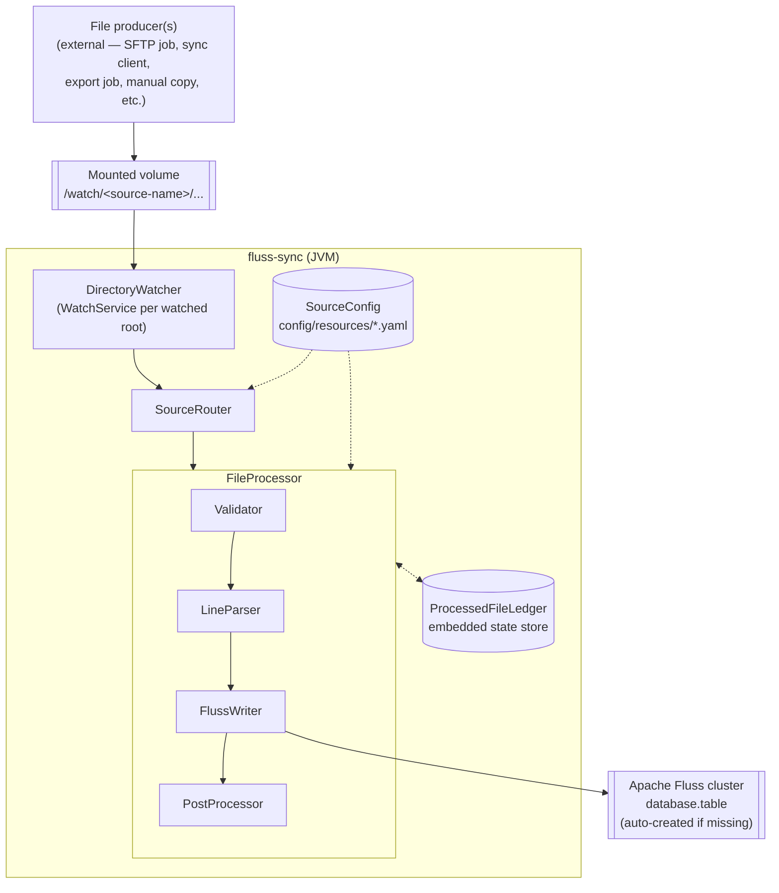
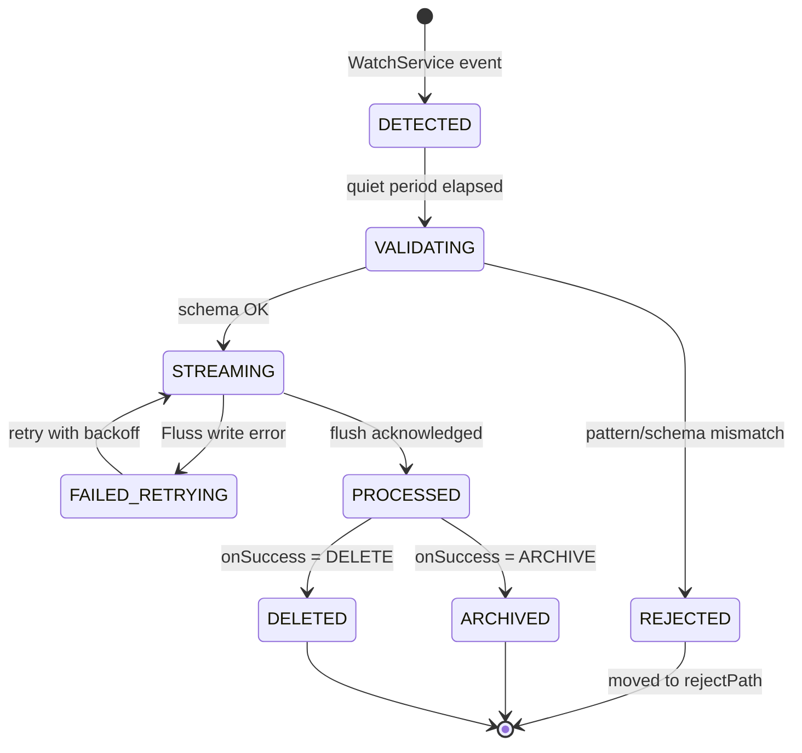
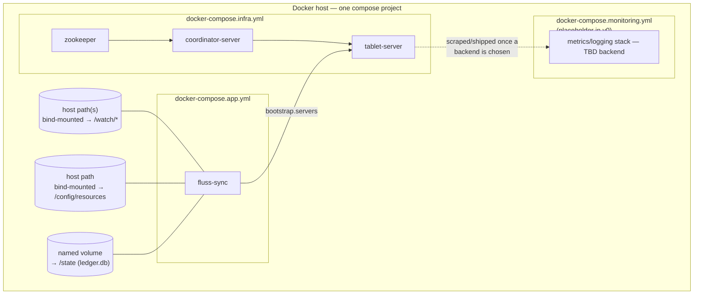

# Fluss Sync: Design Doc

| | |
|---|---|
| **Status** | Implemented (v0) |
| **Author** | Avik Mandal |
| **Last updated** | 2026-08-25 |
| **Reviewers** | TBD |

## Objective

Build a configurable Java application, **fluss-sync**, that watches configured
local directory trees for new files, validates and parses each file against a
per-source configuration, converts every line of a matching file into a stream
record, and writes that stream into a configured [Apache Fluss](https://fluss.apache.org)
table.

## Background

Watched folders are used as a low-friction drop point for data files (e.g.
exports from external systems, partner feeds, batch reports) — the folder
itself may be populated by any means (an SFTP/copy job, a scheduled export,
a sync client such as Dropbox, or a person manually placing a file); fluss-sync
does not care how the file got there, only that it appears on the local
filesystem path it is watching. Today there is no automated path from "a
file lands in the folder" to "the data is queryable as a stream in Fluss."
Getting data into Fluss requires a person to notice the file and run an ad
hoc import.

fluss-sync removes that manual step: once a source is configured, any file
that lands in its watched folder and matches the configured shape is
automatically streamed into Fluss, with no per-file human action required.

## Goals

* Watch one or more local directories (paths mounted into the app's
  container, regardless of how files get placed there) for file create/rename
  events.
* Support pluggable, per-directory ("source") configuration describing:
  * which files are in scope (path/glob pattern),
  * the expected file shape (CSV/delimited: delimiter, header presence,
    column names, types),
  * the destination Fluss table (database, table name, key columns if any),
  * post-processing behavior (archive or delete).
* Validate incoming files against the configured schema before writing
  anything to Fluss; reject files that don't match.
* Convert each valid line of a file into one Fluss record and write it to the
  configured table, creating the table automatically if it does not exist.
* Run as a single, long-lived instance that watches all configured sources
  concurrently.
* Be safe to restart: a crash/restart must not silently skip or duplicate an
  already-fully-processed file's data in the common case.

## Non-Goals

* Coordinating multiple fluss-sync replicas processing the same source
  (single-instance deployment only for v0; see Alternatives Considered).
* Direct integration with any specific cloud storage/sync provider's API
  (webhooks or polling) — v0 is a pure local filesystem watcher; it relies on
  whatever external mechanism (SFTP job, sync client, manual copy, etc.)
  places files at the watched path and does not integrate with any
  provider's cloud API.
* Supporting file formats other than CSV/delimited text (JSON Lines, Parquet,
  Excel, etc.) — the config schema is designed to be extensible to these
  later, but v0 implements only delimited text.
* Schema evolution of destination Fluss tables (adding/removing columns on an
  existing table). v0 only creates a table when it is missing; it does not
  reconcile drift between config and an existing table's schema.
* A UI or REST API for managing configuration. Configuration is static files
  deployed with the app.
* Exactly-once delivery guarantees to Fluss. v0 targets at-least-once with a
  documented duplicate scenario (see [Failure Modes](#failure-modes-and-guarantees)).

## Overview



At a high level:

1. **DirectoryWatcher** registers a `WatchService` on every configured
   source's root directory (recursively) and emits `FileEvent`s when a file
   is created or fully written.
2. **SourceRouter** matches the event's path against the owning
   `SourceConfig` (a directory tree is watched 1:1 with one source config).
   **v0's actual implementation doesn't route through a shared component
   this way** — it runs one dedicated `DirectoryWatcher` + `FileProcessor`
   thread per source instead, which is functionally equivalent but leaves
   the `SourceRouter` class unused. Reconciling the diagram with the
   implementation (either wiring `SourceRouter` in or removing it) is
   tracked in [Deferred to v2](#deferred-to-v2).
3. **FileProcessor** orchestrates, per file:
   * **Validator** — confirms the file matches the configured pattern and
     that its header/shape is consistent with the configured schema.
   * **LineParser** — streams the file line by line, splitting on the
     configured delimiter and mapping fields to typed columns.
   * **FlussWriter** — for each parsed row, appends a record to the
     destination table's `AppendWriter`, flushing in batches.
   * **PostProcessor** — on success, archives or deletes the file per
     config; on failure, moves the file to a configured `rejected/` folder
     with an error sidecar file.
4. The **ProcessedFileLedger** records, per file, its path, content hash, and
   terminal state (`PROCESSED` / `REJECTED`), so a restart can distinguish
   "already handled" files from files that need (re)processing.

## Repository Layout

```
fluss-sync/
├── app/
│   └── sync/                    # fluss-sync application module (Java)
│       ├── src/main/java/...
│       ├── src/test/java/...
│       └── Dockerfile
├── config/
│   ├── docker/
│   │   ├── docker-compose.infra.yml       # ZooKeeper + Fluss CoordinatorServer/TabletServer
│   │   ├── docker-compose.app.yml         # fluss-sync service
│   │   ├── docker-compose.monitoring.yml  # metrics/logging stack (placeholder in v0)
│   │   └── .env.example
│   ├── resources/               # SyncSource *.yaml configs (one per watched source)
│   └── apps/
│       └── sync/
│           └── application.yaml # global app config (parsing defaults, retention, health)
├── doc/
│   └── design/                  # design docs (this file)
├── gradle/
│   ├── wrapper/                 # Gradle wrapper jar + properties
│   └── libs.versions.toml       # centralized dependency/plugin version catalog
├── build.gradle
├── settings.gradle
├── gradlew / gradlew.bat
└── Makefile                     # thin wrapper over gradle/docker compose targets
```

* `app/sync` holds the actual `DirectoryWatcher` / `SourceRouter` /
  `FileProcessor` / `FlussWriter` / `ProcessedFileLedger` code described in
  [Overview](#overview) — a single Gradle module for v0, leaving room to
  split into multiple modules under `app/` later without disturbing
  `config/` or the root build files.
* `config/docker` and `config/resources` are deliberately separate from
  `app/`: neither is Java source, and keeping deployment assets and
  per-source configuration under one `config/` parent mirrors how they're
  bind-mounted together into the `fluss-sync` container (see
  [Deployment](#deployment)).
* `config/apps/sync/application.yaml` is the single global config file for
  the `sync` app — settings that apply across all sources rather than to
  one (parsing defaults, retention, health checks; see
  [Application configuration](#application-configuration)) — as opposed to
  `config/resources/*.yaml`, which is one file per watched source. It's
  nested under `apps/sync/` (mirroring `app/sync`) rather than sitting
  directly under `config/`, so that if a second app is ever added under
  `app/`, its global config has an equally-scoped home at
  `config/apps/<app-name>/application.yaml` instead of colliding with this
  one at the `config/` root.
* `gradle/`, `build.gradle`, `settings.gradle`, and the `gradlew` wrapper
  scripts are at the repo root, following standard Gradle multi-module
  convention, with `settings.gradle` including `app/sync`.
* `gradle/libs.versions.toml` is Gradle's [version catalog](https://docs.gradle.org/current/userguide/version_catalogs.html):
  every dependency (`fluss-client`, YAML parser, ledger store, test
  framework, etc.) and plugin version is declared once there and referenced
  by alias from `app/sync/build.gradle` (e.g. `libs.fluss.client`), instead
  of version strings being repeated or drifting across module build files.
  This matters even with a single module today because it's the mechanism
  that keeps a second module under `app/` (see above) from redeclaring the
  same dependency at a different version later.

## Detailed Design

### Configuration

Each watched source is described by one YAML file under
`config/resources/*.yaml`, using an `apiVersion`/`kind`/`metadata`/`spec`
envelope (in the same spirit as other flow/task config conventions used
elsewhere, e.g. [trino-with-ice's `flow.yaml`](https://github.com/skhatri/trino-with-ice/blob/main/examples/tasks/bicycles/flow.yaml)):
one top-level resource of `kind: SyncSource` per watched directory. Example:

```yaml
apiVersion: fluss-sync.io/v1
kind: SyncSource
metadata:
  name: partner-orders
spec:
  observability:
    lineage: true
    metrics: true
    log: true
    validation: true
  security:
    roles:
      - "sales-write-role"
  tag:
    - "sales"
    - "csv"
    - "event-stream"
  contact:
    owner: "@avik"
    support:
      - "#data-eng"

  watch:
    path: /watch/partner-orders
    filePattern: "*.csv"
    stability:
      quietPeriodMs: 5000     # time file size must be unchanged before processing

  format:
    type: delimited
    delimiter: ","
    quoteChar: "\""       # RFC 4180 quoting; set to "" to disable quote handling
    escapeChar: "\""      # doubled-quote escape, per RFC 4180
    hasHeader: true
    columns:
      - name: order_id
        type: STRING
      - name: order_ts
        type: TIMESTAMP
      - name: amount_cents
        type: BIGINT
      - name: currency
        type: STRING

  validation:
    mode: FULL              # FULL (default) | SAMPLED — see Validation below
    sampleSize: 1000        # only used when mode is SAMPLED

  destination:
    database: sales
    table: partner_orders_raw
    tableType: LOG          # LOG | PRIMARY_KEY
    primaryKey: []          # required if tableType is PRIMARY_KEY

  onSuccess:
    action: ARCHIVE          # ARCHIVE | DELETE
    archivePath: "/watch/partner-orders/_processed/{yyyy}/{MM}/{dd}"

  onFailure:
    action: REJECT
    rejectPath: "/watch/partner-orders/_rejected"
```

Field notes:

* `metadata.name` is the source name, used as the ledger's `sourceName` key
  and in structured logs/metrics.
* `spec.observability` toggles per-source lineage/metrics/log/validation
  emission — a source can opt out of the heavier checks (e.g. `validation`)
  if its shape is well-trusted. **v0 parses and stores this field but does
  not yet read it anywhere in the pipeline** — every source currently
  behaves as if all four flags are `true`; see [Deferred to v2](#deferred-to-v2).
* `spec.security.roles` names the role(s) required to write to the
  destination table, enforced wherever fluss-sync's own service identity is
  authorized against Fluss/cluster ACLs.
* `spec.tag` and `spec.contact` are metadata-only — they don't affect
  processing, and are intended to flow into logs/metrics for ownership and
  discovery once the metrics work in [Deferred to v2](#deferred-to-v2)
  lands; v0 does not yet surface them anywhere.
* `spec.watch`, `spec.format`, `spec.validation`, `spec.destination`,
  `spec.onSuccess`, and `spec.onFailure` are the fields that directly drive
  processing, as described in the sections below.
* `spec.format.quoteChar`/`escapeChar` control RFC 4180-style CSV quoting
  (a quoted field may contain the delimiter or a newline); a source whose
  files are guaranteed simple/unquoted can set `quoteChar: ""` to disable
  quote-aware parsing entirely.
* `spec.validation.mode` defaults to `FULL` — every row of the file is
  validated before any row is written to Fluss (see
  [Validation](#validation)). Setting it to `SAMPLED` trades that guarantee
  for throughput on very large, well-trusted files.
* A `PRIMARY_KEY` destination sets `spec.destination.primaryKey` to one or
  more column names from `spec.format.columns` and typically pairs with
  `onSuccess.action: DELETE`, since a keyed "latest state" source has no
  need to retain the raw file once its rows are upserted.

Config is loaded at startup; a source directory with no matching config is
not watched. v0 does not hot-reload config — changes require a restart. This
keeps the file-watching lifecycle simple and matches the single-instance,
static-deployment model in [Non-Goals](#non-goals).

### Application configuration

Settings that apply across every source, rather than to one, live in a
single global file, `config/apps/sync/application.yaml`, separate from the
per-source `SyncSource` files:

```yaml
apiVersion: fluss-sync.io/v1
kind: ApplicationConfig
spec:
  parsing:
    nullLiteral: ""                        # cell value treated as SQL NULL
    timestampFormat: "yyyy-MM-dd'T'HH:mm:ss" # java.time pattern for TIMESTAMP columns
    dateFormat: "yyyy-MM-dd"                 # java.time pattern for DATE columns

  retention:
    enabled: true
    days: 15    # age (from processedAt) at which archived files, rejected
                # files, and their ledger entries are eligible for cleanup

  health:
    enabled: true
    port: 8080
    path: /healthz
```

* `parsing` supplies the type-format defaults `LineParser` needs to convert
  a raw CSV cell into a typed value for every `format.columns[].type` across
  all sources (e.g. what string means "null", what pattern a `TIMESTAMP`
  column is expected to match) — this is deliberately global rather than
  per-source, since source files sharing a data pipeline convention
  typically share these conventions too. A per-source override is not
  supported in v0.
* `retention` and `health` are described in
  [Retention](#retention) and [Health checks](#health-checks) below.

### File detection and stability

Whatever places a file into the watched folder (a sync client, an SFTP
transfer, a large export job) may write it incrementally, so a `WatchService`
create event does not mean the file is complete. fluss-sync uses a **quiet
period** check: after an event, it polls the file's size/mtime every second
and only hands the file to the `FileProcessor` once the size has been stable
for `stability.quietPeriodMs`. This is a pragmatic heuristic (not a hard
guarantee) appropriate for a v0 single-instance batch-file use case.

A file that is still zero bytes once it becomes stable is **skipped**, not
processed — it is left in place and simply re-checked if a later event
fires on it (e.g. once a producer actually writes content). This avoids
treating a not-yet-written placeholder file as a validation failure.

### Watch exclusions

`DirectoryWatcher` registers each source's `watch.path` recursively, which
would otherwise also observe files landing in that source's own
`onSuccess.archivePath` and `onFailure.rejectPath` subfolders as
fluss-sync moves files into them — re-triggering detection on files
fluss-sync itself just placed there. To prevent this, the watcher excludes
any path under a configured `archivePath` or `rejectPath` (matched by
prefix) from emitting `FileEvent`s, regardless of where those paths live
relative to `watch.path`.

### Validation

Before any row is written to Fluss:

* The file must match `filePattern`. A file that does not match is treated
  as a validation failure like any other — it is actively routed to
  `onFailure` (moved to `rejectPath`), not silently left alone, so that a
  misdirected or unexpected file in a watched folder is visible rather than
  invisible.
* If `hasHeader` is true, the header row's column names must match
  `format.columns` (order-insensitive, name-sensitive).
* Every data row is checked for column count and type-parseability against
  `format.columns` (quote-aware split per `format.quoteChar`/`escapeChar`,
  values parsed per the type-format rules in
  [Application configuration](#application-configuration)).

`spec.validation.mode` defaults to `FULL`: the entire file is validated
before a single row is written to Fluss, which is what makes "a file that
fails validation is never partially written" hold even for large files —
`STREAMING` only begins after `VALIDATING` has read every row. Setting
`spec.validation.mode: SAMPLED` validates only `spec.validation.sampleSize`
rows up front and accepts the risk of a later malformed row surfacing mid
`STREAMING` (as a `FAILED_RETRYING`/`REJECTED` outcome on a file with some
rows already durably written to Fluss) in exchange for not reading
multi-gigabyte files twice; this trade-off should only be opted into for
sources whose file shape is already well-trusted.

### Streaming into Fluss

* On startup, and again lazily on first use of a source, fluss-sync uses the
  Fluss `Admin` API to check whether `destination.database` /
  `destination.table` exists, creating them (with the schema derived from
  `format.columns`) if not.
* For `tableType: LOG`, each row is written via an `AppendWriter`
  (`TypedAppendWriter`) — the natural fit, since raw file lines are an
  append-only event stream and files may contain repeated/duplicate rows
  that should all be preserved.
* For `tableType: PRIMARY_KEY`, each row is written via an `UpsertWriter`,
  keyed by `destination.primaryKey`, for sources where a file represents the
  latest state of a keyed entity rather than an event log.
* Writes for one file are flushed as a unit at end-of-file; the file is only
  handed to `PostProcessor` after a successful flush acknowledgment from
  Fluss.
* When `spec.validation.mode` is `FULL` (the default), `VALIDATING` and
  `STREAMING` share the same parsed rows rather than re-reading and
  re-parsing the file a second time — validation buffers (or streams
  through, depending on file size) the already-`LineParser`-parsed rows,
  and `STREAMING` consumes that same parsed sequence to write to Fluss.

### Post-processing

* `ARCHIVE`: file is moved (not copied) to `archivePath`, with the path
  template's `{yyyy}/{MM}/{dd}` tokens resolved against the processing date
  **in UTC** (not the host's local timezone), so archive paths are
  consistent regardless of where the container runs. The archive path
  lives under the same watched root by default, so it does not require a
  separate mount.
* `DELETE`: file is removed from disk after a successful Fluss flush.
* Both actions are only taken after the ledger records the file as
  `PROCESSED`, so a crash between "Fluss flush succeeded" and "file moved"
  is recoverable (see below).

### Processed-file ledger and restart safety

fluss-sync maintains an embedded, on-disk ledger (a lightweight local key
store, e.g. SQLite or MapDB — file: `state/ledger.db`) keyed by
`(sourceName, filePath, contentHash)` → `{status, processedAt}`.

* Before processing a file, fluss-sync checks the ledger. If an entry exists
  with status `PROCESSED` for the same content hash, the file is skipped
  (handles the case where a restart re-delivers a `WatchService` event for a
  file that was already fully handled but not yet archived/deleted).
* The ledger entry is written with status `PROCESSED` **after** the Fluss
  write is flushed and acknowledged, but the entry is written **before**
  the archive/delete step runs. This ordering means:
  * If the process crashes before the Fluss flush completes, the file is
    reprocessed from scratch on restart (at-least-once).
  * If the process crashes after the Fluss flush but before archive/delete,
    on restart the ledger already shows `PROCESSED`, so the file is not
    re-streamed to Fluss — it is simply archived/deleted directly.

### Retention

Archived files, rejected files, and their corresponding ledger entries
accumulate indefinitely otherwise. A background cleanup pass — driven by
`config/apps/sync/application.yaml`'s `retention` block — removes archived/rejected
files and ledger rows whose `processedAt` is older than `retention.days`
(default **15 days**). Setting `retention.enabled: false` (or `days: 0`)
disables cleanup entirely, leaving files and ledger rows in place forever,
for sources where an operator wants to manage retention externally.

Deleting a ledger row for a file whose `PROCESSED` entry has aged out is
safe: the row's only purpose is to prevent re-streaming a *duplicate* of a
file that's still sitting in the watched folder or its archive/reject
subfolder, and retention only removes rows once the archived/rejected file
itself has also been removed.

### File lifecycle



Ledger entries are written at the `PROCESSED` transition — after the Fluss
flush is acknowledged but before `ARCHIVED`/`DELETED` runs — which is what
makes the archive/delete step idempotent across restarts (see below).

### Failure modes and guarantees

| Scenario | Behavior |
|---|---|
| File doesn't match configured pattern/schema | Routed to `rejectPath`, never written to Fluss |
| Fluss cluster unreachable during write | Row batch write fails; the file is left in place (not archived/deleted). **In v0 this is a single attempt with no automatic retry** — the file is only re-attempted if a later filesystem event happens to fire on it. Bounded retry-with-backoff is tracked in [Deferred to v2](#deferred-to-v2). |
| Process crash mid-file, before flush ack | File is reprocessed in full on restart — **possible duplicate rows** if any partial batch was actually acknowledged by Fluss before the crash. This is the accepted at-least-once gap for v0. |
| Process crash after flush ack, before archive/delete | Ledger prevents re-streaming; archive/delete is retried on restart |
| Same file content re-dropped into the folder | Content hash in the ledger causes it to be skipped |
| Two files with same name, different content, dropped in sequence | Each is a distinct ledger entry (hash differs), both processed |

### Observability

* Structured logs (one line per file transition: `DETECTED`, `VALIDATING`,
  `STREAMING`, `PROCESSED`, `REJECTED`, `FAILED_RETRYING`) with source name,
  file path, and row count. **v0 logs most but not all of these
  transitions** (`VALIDATING`, `ARCHIVED`, and `DELETED` don't currently get
  their own log line, and no line includes a row count yet); closing that
  gap is tracked in [Deferred to v2](#deferred-to-v2).
* Per-source counters: files processed, files rejected, rows written, write
  latency — exposed via a metrics registry (e.g. Micrometer) for future
  scraping; v0 does not mandate a specific metrics backend. **No metrics
  registry is wired up in v0 at all** — this is entirely deferred to v2.

### Health checks

fluss-sync exposes an HTTP health endpoint (`config/apps/sync/application.yaml`'s
`health.port`/`health.path`, default `:8080/healthz`) so both Docker Compose
and a future Kubernetes deployment have something to probe instead of only
inferring liveness from the process being alive. It is intended to report
healthy only when: every configured source's `DirectoryWatcher` is actively
registered, the `ProcessedFileLedger`'s backing store is reachable, and the
last attempted Fluss write did not fail (i.e. no source is currently stuck
in `FAILED_RETRYING`). `health.enabled: false` turns the endpoint off.
**v0 only implements the ledger-reachability check** — the endpoint does
not yet track watcher registration or `FAILED_RETRYING` sources, so it can
currently report healthy while a source is stuck; see
[Deferred to v2](#deferred-to-v2).

## Deployment

v0 targets **Docker Compose** as the deployment mechanism, running fluss-sync
alongside a Fluss cluster (ZooKeeper + CoordinatorServer + TabletServer, per
[Fluss's Docker deployment guide](https://fluss.apache.org/docs/install-deploy/deploying-with-docker/))
on a single host. This is deliberately the simplest thing that lets
fluss-sync and Fluss be brought up together with one command, matching the
single-instance scope in [Goals](#goals). A future Kubernetes deployment
(Helm chart or plain manifests) is expected but out of scope for v0 — see
below.



Rather than one `docker-compose.yml`, `config/docker/` holds one compose
file per concern, combined at run time with multiple `-f` flags into a
single compose project (so services in different files still share one
default network and can `depends_on`/resolve each other by service name):

* `docker-compose.infra.yml` — the Fluss cluster itself (ZooKeeper,
  CoordinatorServer, TabletServer).
* `docker-compose.app.yml` — the `fluss-sync` service.
* `docker-compose.monitoring.yml` — reserved for a metrics/logging stack
  (e.g. Prometheus + Grafana) once [Observability](#observability)'s "v0
  does not mandate a specific metrics backend" is resolved; in v0 this file
  exists as a placeholder so the naming convention and the Makefile wiring
  are already in place, but it may define no services yet.

Contents of `docker-compose.infra.yml` and `docker-compose.app.yml` as
implemented (paths are relative to `config/docker/`, per the layout in
[Repository Layout](#repository-layout)):

```yaml
# docker-compose.infra.yml
services:
  zookeeper:
    image: zookeeper:3.9.2

  coordinator-server:
    image: apache/fluss:0.9.1-incubating
    command: coordinatorServer
    depends_on:
      - zookeeper
    environment:
      - |
        FLUSS_PROPERTIES=
        zookeeper.address: zookeeper:2181
        bind.listeners: FLUSS://coordinator-server:9123
        remote.data.dir: /tmp/fluss/remote-data

  tablet-server:
    image: apache/fluss:0.9.1-incubating
    command: tabletServer
    depends_on:
      - coordinator-server
    environment:
      - |
        FLUSS_PROPERTIES=
        zookeeper.address: zookeeper:2181
        bind.listeners: FLUSS://tablet-server:9123
        data.dir: /tmp/fluss/data
        remote.data.dir: /tmp/fluss/remote-data
```

`image` must be `apache/fluss:<version>` (the Apache-incubation image, matching
`fluss-client`'s version in `gradle/libs.versions.toml`) — the older
`fluss/fluss:latest` Docker Hub image predates the Apache move, runs a
different server version with different config keys, and is wire-incompatible
with this client. `bind.listeners` must resolve to each service's own
container hostname (not `0.0.0.0`), since the server registers that address
verbatim in ZooKeeper for peer/client discovery.

```yaml
# docker-compose.app.yml
services:
  fluss-sync:
    build:
      context: ../..
      dockerfile: app/sync/Dockerfile
    depends_on:
      - tablet-server
    environment:
      FLUSS_BOOTSTRAP_SERVERS: "tablet-server:9123"
    volumes:
      - ../resources:/config/resources:ro
      - ../apps/sync/application.yaml:/config/application.yaml:ro
      - ../../watch:/watch
      - fluss-sync-state:/state
    healthcheck:
      test: ["CMD", "curl", "-f", "http://localhost:8080/healthz"]
      interval: 30s
      timeout: 5s
      retries: 3

volumes:
  fluss-sync-state:
```

Notes:

* `docker-compose.app.yml`'s `fluss-sync.depends_on: [tablet-server]` only
  resolves when both files are passed to the same `docker compose`
  invocation (as the Makefile does — see below); it is not runnable via
  `docker-compose.app.yml` alone.
* Every `spec.watch.path` and `onSuccess.archivePath`/`onFailure.rejectPath`
  in a `SyncSource` config resolves to a path under the container's
  `/watch` mount — the compose file is responsible for bind-mounting the
  actual host folder(s) that files get placed into underneath it.
* `/config/resources` and `/config/application.yaml` are mounted read-only
  from the repo's `config/resources/` and `config/apps/sync/application.yaml`
  respectively — the container-side path stays a fixed, flat
  `/config/application.yaml` regardless of where the file lives on the
  host, so the app doesn't need to know about the `apps/sync/` nesting.
  Config changes require restarting the `fluss-sync` container (consistent
  with the no-hot-reload behavior described under
  [Configuration](#configuration)).
* The `healthcheck` stanza uses the endpoint from
  [Health checks](#health-checks) so `docker compose ps` and `depends_on`
  conditions can reflect real readiness, not just "the process started."
* The `fluss-sync` image is built from `app/sync/Dockerfile` — kept next to
  the module it builds rather than under `config/docker/`, which holds only
  compose files and env examples — with the build context set to the repo
  root so it can access the Gradle build.
* The ledger (`/state/ledger.db`) lives on a named Docker volume so it
  survives container restarts/recreation, which is required for the
  restart-safety guarantees in [Processed-file ledger and restart safety](#processed-file-ledger-and-restart-safety).

### Makefile

A root `Makefile` wraps the Gradle and Docker Compose commands above so
day-to-day development doesn't require remembering module paths, the
compose file split, or the `-f` flag ordering:

| Target | Purpose |
|---|---|
| `make build` | `./gradlew :app:sync:build` |
| `make test` | `./gradlew :app:sync:test` |
| `make run` | `./gradlew :app:sync:run` — run fluss-sync locally against an already-running Fluss cluster |
| `make infra-up` | `docker compose -f config/docker/docker-compose.infra.yml up -d` — bring up just ZooKeeper + Fluss, e.g. to pair with `make run` |
| `make up` | `docker compose -f config/docker/docker-compose.infra.yml -f config/docker/docker-compose.app.yml -f config/docker/docker-compose.monitoring.yml up -d --build` — bring up the full stack, always rebuilding the `fluss-sync` image from local source first |
| `make down` | same `-f` list as `make up`, with `down` |
| `make logs` | same `-f` list as `make up`, with `logs -f fluss-sync` |
| `make clean` | `./gradlew clean` |

Every compose-backed target passes the same fixed `-f` list (all three
files) so `up`/`down`/`logs` always operate on the one combined project
regardless of which file actually defines a given service — this keeps the
file split an internal detail of `config/docker/`, not something a
contributor building day-to-day needs to reason about.

**Future: Kubernetes.** The same three concerns — watched-folder storage,
config, and ledger state — map onto Kubernetes primitives (a
`PersistentVolume`/`PersistentVolumeClaim` for the watch path and ledger, a
`ConfigMap` for `config/resources/*.yaml` and
`config/apps/sync/application.yaml`)
behind a single-replica `Deployment` or `StatefulSet`, with the
[health endpoint](#health-checks) wired to `livenessProbe`/`readinessProbe`. Moving to Kubernetes does not by itself remove the
single-instance constraint in [Non-Goals](#non-goals): running more than one
replica still requires the distributed-locking/shared-ledger work called out
under [Alternatives Considered](#alternatives-considered). A Kubernetes
manifest/Helm chart is intentionally deferred to a later design doc revision
once the Compose-based v0 is running.

## Alternatives Considered

**Cloud storage provider API (webhooks or polling) instead of local
filesystem watch.** Rejected for v0 because it would require provisioning
and managing per-provider credentials/OAuth and either a publicly reachable
webhook endpoint or a polling loop against that provider's API rate limits —
more operational surface than needed when a container can simply mount a
local, already-synced folder, and it would tie fluss-sync's core watch logic
to one specific provider's API instead of the filesystem. Revisit if a
source's files only exist in a cloud store with no local sync mechanism
available.

**Horizontal scale-out (multiple instances) with distributed locking.**
Rejected for v0 given the current load does not require it, and it would
add coordination complexity (distributed lock/lease over which instance
owns which source, and a shared rather than embedded ledger). The design
keeps this door open: the ledger's `(sourceName, filePath, contentHash)`
key scheme generalizes to a shared store (e.g. Fluss itself, or a small
relational table) if multi-instance becomes necessary later.

**Requiring destination Fluss tables to be pre-created.**
Rejected in favor of auto-create, since forcing an operator to manually
create a matching table for every new source config duplicates the schema
information already present in `format.columns` and is an easy source of
drift/typos between the two.

## Open Questions

* Should `format.columns` support a nested/optional-column mode for files
  with variable column counts, or is a fixed schema sufficient for all
  known sources?
* What is the retention/cleanup policy for the `_processed` archive
  subfolders and the `_rejected` folder — is that managed by fluss-sync or
  left to whatever external process/retention policy governs the watched
  volume?
* Do any sources need `PRIMARY_KEY` tables in practice, or is `LOG` the only
  table type needed for the initial set of sources?

## Deferred to v2

The following gaps were identified during design review and are
deliberately **not** addressed in v0 — each needs real design work, not a
one-line fix, so they're tracked here rather than folded into this
document:

* **Retry-loop duplicate writes.** The `STREAMING → FAILED_RETRYING →
  STREAMING` retry loop (see [File lifecycle](#file-lifecycle)) can
  re-send rows that already landed in Fluss before the failure, producing
  duplicates independent of the crash-restart case already documented in
  [Failure modes and guarantees](#failure-modes-and-guarantees). Needs
  either idempotent/offset-aware retries or per-batch write tracking.
* **Concurrency model.** Whether files within one source process serially
  or in parallel, and how a table's `AppendWriter`/`UpsertWriter` is shared
  (or not) across concurrently-processing files, is unspecified. v0 ships
  with an implementation default (documented in code, not here) rather than
  a designed model.
* **Config-time validation.** Startup behavior for invalid configs —
  duplicate `metadata.name` across `SyncSource` files, overlapping or
  nested `watch.path` values across sources, malformed YAML — is
  unspecified: whether it aborts startup entirely or skips just the bad
  source with a warning.
* **Retry / dead-letter path.** A file that fails to write to Fluss
  currently gets exactly one attempt and then sits as `FAILED_RETRYING`
  with no automatic re-attempt and no dead-letter mechanism — it only gets
  reprocessed if a later filesystem event happens to fire on it (see the
  corrected [Failure modes and guarantees](#failure-modes-and-guarantees)
  table). Needs a bounded-retry-plus-alerting (or dead-letter folder)
  design; earlier drafts of this doc described this as "retried with
  backoff," which doesn't match v0's actual behavior.
* **Fluss cluster authentication.** How fluss-sync itself authenticates to
  the Fluss cluster (credentials, TLS) is unaddressed; `spec.security.roles`
  currently only names roles without specifying how they're presented or
  enforced.
* **`spec.observability` toggles are inert.** `lineage`/`metrics`/`log`/
  `validation` are parsed onto `SyncSourceConfig` but nothing in the
  pipeline reads them — every source currently behaves as if all four are
  `true`, so a source can't yet opt out of full validation or any other
  heavier check via config.
* **No metrics registry.** The Observability section's per-source counters
  (files processed/rejected, rows written, write latency) have no
  implementation in v0 — only structured logs exist, and even those don't
  yet cover every file-lifecycle transition or include row counts (see
  [Observability](#observability)).
* **Health endpoint doesn't track watcher/write-failure state.** `/healthz`
  is documented to also check that every source's `DirectoryWatcher` is
  registered and that no source is stuck in `FAILED_RETRYING`, but v0 only
  actually checks that the ledger's SQLite connection is reachable — it can
  report healthy while a source is silently stuck (see
  [Health checks](#health-checks)).
* **`SourceRouter` doesn't match the implementation.** The Overview
  describes a single `DirectoryWatcher → SourceRouter → FileProcessor`
  pipeline, but v0 instead runs one dedicated watcher+processor thread per
  source, leaving the `SourceRouter` class defined and unused. Either wire
  it in or remove it and update the diagram to describe the per-source-
  thread model actually running.
