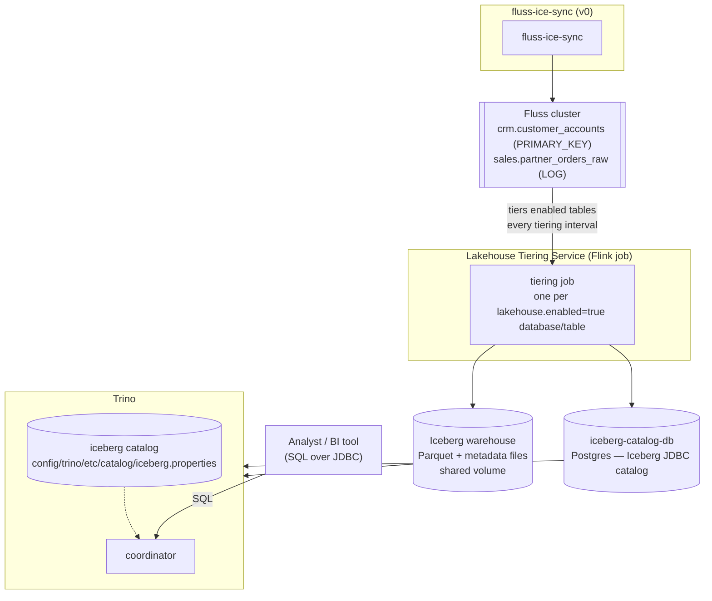
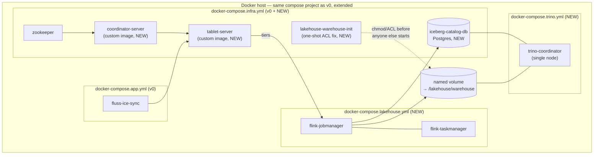

# Trino Integration: Design Doc

| | |
|---|---|
| **Status** | Implemented — verified end to end against a real Docker Compose stack |
| **Author** | Avik Mandal |
| **Last updated** | 2026-08-26 |
| **Reviewers** | TBD |
| **Depends on** | [Fluss Sync: Design Doc (v0)](./v0-fluss-ice-sync-design.md) |

## Objective

Make every Fluss table backing a configured `SyncSource` (e.g. `crm.customer_accounts`,
`sales.partner_orders_raw`, and any table added by a future `config/resources/*.yaml`
file) queryable with standard SQL via [Trino](https://trino.io), without any
per-table onboarding step on the Trino side — a table becomes queryable simply
because it exists as a `SyncSource` destination.

## Background

v0 gets file data into Fluss tables, but the only way to read that data back
out today is the Fluss client API or Flink SQL against the Fluss catalog
directly. Neither is accessible to analysts or the BI tools (dashboards, ad
hoc SQL clients) that make the data actually useful once it's landed — those
tools overwhelmingly speak SQL over JDBC/ODBC, which Trino provides and Flink
does not aim to.

Fluss does not (yet) ship a connector that lets Trino read its tables
directly off the CoordinatorServer/TabletServer; it instead documents a
[streaming lakehouse architecture](https://fluss.apache.org) for exactly this
gap: a **Lakehouse Tiering Service** — a Flink job that Fluss provides —
continuously compacts and copies each enabled Fluss table's data (both a
`LOG` table's full append history and a `PRIMARY_KEY` table's deduplicated
latest-value state) into Parquet files organized as a table in a lake format
(Paimon, Iceberg, or Lance), registered in a catalog/metastore. Any engine
with a connector for that lake format — Trino included — can then query the
tiered data with its own already-mature connector, at the cost of the
tiering interval's staleness instead of true real-time reads (which remains
Flink's job, via Fluss's "union read" of the live log plus the lake table).

This doc designs the pieces needed to stand that path up for every table
fluss-ice-sync currently manages: enabling tiering on those tables, running the
tiering service, and configuring Trino to see the result as ordinary SQL
schemas and tables. **v1 tiers into Apache Iceberg, not Paimon** — an
earlier iteration of this design chose Paimon and got as far as a working
Docker build, but hit an unbridgeable version gap between the Paimon format
Fluss's tiering service writes (1.3.1) and the Paimon reader the only
buildable community Trino-Paimon connector bundles (0.7); see
[Alternatives Considered](#alternatives-considered) for the full account.
Trino ships a built-in, actively-maintained Iceberg connector, so the
Iceberg path needs no custom Trino plugin at all.

## Goals

* Every `SyncSource` destination table with tiering enabled (see below)
  appears in Trino as `<catalog>.<database>.<table>` — e.g.
  `iceberg.crm.customer_accounts`, `iceberg.sales.partner_orders_raw` — with
  no Trino-side DDL or catalog edit required per source. Adding a new
  `SyncSource` YAML file is sufficient for its destination table to become
  queryable once created and tiered.
* Extend the `SyncSource` schema (`spec.destination.lakehouse.enabled`, a v1
  addition) so tiering is an explicit, per-source opt-in — mirroring the
  existing per-source `spec.observability` toggles in v0 — with a
  document-wide default in `application.yaml`.
* `PRIMARY_KEY` tables surface in Trino as deduplicated "current state" (one
  row per key), matching what a Flink reader of the same table would see.
  `LOG` tables surface as the full accumulated append history.
* Document and bound the freshness gap: Trino's view reflects the last
  completed tiering pass, not the live Fluss log; the tiering interval is a
  configured value, not "real-time."
* Read-only SQL access (`SELECT`) from Trino for v1.
* Schema-level read authorization in Trino, gated on a read-role paired with
  each source's existing `spec.security.roles` write role (e.g.
  `sales-write-role` pairs with `sales-read-role`, granted `SELECT` on
  `iceberg.sales.*`).
* Deploy Trino and the tiering job alongside the existing Docker Compose
  stack, following the same `config/docker/*.yml` + `Makefile` pattern as v0.

## Non-Goals

* True real-time (sub-tiering-interval) reads through Trino — that remains
  Flink's union-read capability against live Fluss, not this design.
* Write access from Trino back into Fluss or the lake tables.
* A native Fluss-Trino connector reading the CoordinatorServer/TabletServer
  directly (no tiering hop) — see [Alternatives Considered](#alternatives-considered).
* A BI/semantic layer, materialized views, or query result caching on top of
  Trino.
* Row- or column-level access control (schema-level only for v1).
* Multi-node Trino sizing/autoscaling for a specific analyst query volume —
  v1 ships a single-coordinator, best-effort worker count sufficient for
  Compose-scale testing.
* Federating Trino queries across catalogs other than the one added here
  (Trino gives this "for free," but no other catalog is in scope for v1).
* Migrating the lake format choice (Iceberg, see
  [Alternatives Considered](#alternatives-considered)) — v1 picks one.

## Overview



At a high level:

1. **fluss-ice-sync** (v0, unchanged) writes rows into Fluss tables as before.
2. A `SyncSource` that sets `spec.destination.lakehouse.enabled: true` causes
   its destination table to be created with Fluss's `table.datalake.enabled`
   property set, marking it eligible for tiering.
3. The **Lakehouse Tiering Service**, a Flink job, watches every table with
   tiering enabled and periodically compacts new Fluss data into the shared
   **Iceberg warehouse** (Parquet data files on a shared volume) — a `LOG`
   table's new rows as append-only files, a `PRIMARY_KEY` table's changes as
   Iceberg row-level deletes/inserts — registering each snapshot in a shared
   **Iceberg JDBC catalog** (a small Postgres database holding only table
   pointers, not data).
4. **Trino**'s built-in `iceberg` connector, configured with `iceberg.catalog.type=jdbc`
   pointed at that same Postgres database, sees every table the tiering job
   has registered. Every Fluss database becomes a Trino schema; every table,
   a Trino table — automatically, because Trino reads the catalog's own
   metadata rather than any fluss-ice-sync- or Trino-specific registry.
5. Analysts/BI tools query Trino with ordinary SQL, e.g.
   `SELECT * FROM iceberg.sales.partner_orders_raw WHERE order_ts > ...`.

## Repository Layout

```
fluss-ice-sync/
├── app/
│   └── sync/                    # unchanged from v0
├── config/
│   ├── docker/
│   │   ├── docker-compose.infra.yml       # unchanged (ZooKeeper + Fluss)
│   │   ├── docker-compose.app.yml         # unchanged (fluss-ice-sync)
│   │   ├── docker-compose.monitoring.yml  # unchanged
│   │   ├── docker-compose.lakehouse.yml   # NEW: Flink JobManager/TaskManager
│   │   │                                  #      running the tiering job
│   │   └── docker-compose.trino.yml       # NEW: Trino coordinator (+ worker)
│   │   ├── fluss/Dockerfile                # NEW: apache/fluss + Hadoop/Postgres-driver
│   │   │                                    #      jars in plugins/iceberg/ (see below)
│   │   ├── flink/Dockerfile               # NEW: base Flink image + Fluss tiering jars
│   │   └── trino/Dockerfile               # NEW: stock trinodb/trino, no custom plugin needed
│   ├── resources/               # SyncSource *.yaml — gains spec.destination.lakehouse
│   ├── apps/sync/application.yaml         # gains a lakehouse-default block
│   └── trino/
│       └── etc/
│           ├── config.properties
│           ├── node.properties
│           ├── jvm.config
│           ├── access-control.properties
│           ├── access-control/rules.json  # schema-level read-role grants
│           └── catalog/
│               └── iceberg.properties     # JDBC catalog + warehouse path
├── doc/
│   └── design/
│       ├── v0-fluss-ice-sync-design.md
│       └── v1-trino-integration-design.md  # this file
├── gradle/ ...
└── Makefile                     # gains lakehouse-up / lakehouse-submit / trino-shell targets
```

* `config/docker/docker-compose.lakehouse.yml` and
  `docker-compose.trino.yml` are separate compose files (not folded into
  `docker-compose.app.yml`), following v0's convention of one file per
  concern combined with `-f` flags — this lets `make infra-up` /
  `make run` continue to work without Trino/Flink for a plain fluss-ice-sync
  dev loop, and lets Trino be brought up (or torn down) independently of the
  tiering job while debugging either in isolation.
* `config/trino/` is a new sibling of `config/resources/` and
  `config/apps/`, not nested under `app/sync/` — neither Flink's tiering
  job nor Trino is part of the `fluss-ice-sync` Java application; they are
  separately deployed processes that happen to read data fluss-ice-sync
  produced. There is no `config/lakehouse/` directory — *which* tables get
  tiered is driven entirely by each table's own `table.datalake.enabled`
  property (set from `SyncSource.spec.destination.lakehouse`), not a
  separate list; the tiering job is submitted imperatively (`make
  lakehouse-submit`) rather than configured via a YAML file.
* `config/trino/etc/catalog/iceberg.properties` is nested under `etc/`
  (not a sibling `config/trino/catalog/`) because that is where Trino's own
  installation layout expects catalog files, and because Docker can't
  create a second, more specific bind mount (`/etc/trino/catalog`) inside
  an already-read-only bind mount (`/etc/trino`) — confirmed by a failed
  `make up` run. Mounting the whole `etc/` tree once, with `catalog/`
  already nested inside it, avoids that.
* `config/docker/fluss/Dockerfile` exists because Fluss's own coordinator/
  tablet-server images ship `fluss-lake-iceberg` pre-bundled in
  `/opt/fluss/plugins/iceberg/`, but Fluss isolates each `plugins/<name>/`
  directory into its own classloader with no cross-plugin visibility —
  confirmed by hitting `ClassNotFoundException: org.apache.hadoop.conf.Configurable`
  at coordinator startup, since the Hadoop classes `fluss-lake-iceberg`
  needs live in the *separate* `plugins/hdfs/` plugin. The Hadoop and
  Postgres-driver jars have to be copied directly into `plugins/iceberg/`
  itself. It's a multi-stage build — a small `eclipse-temurin:21-jdk`
  builder stage packages a `core-site.xml` (see
  [Lake warehouse, catalog, and table format: Iceberg](#lake-warehouse-catalog-and-table-format-iceberg)
  for why) into a jar, since `apache/fluss`'s own runtime image has no
  `jar` tool and Fluss's plugin loader only picks up `.jar` files anyway.
* The root `Makefile` is the single source of truth for the Iceberg JDBC
  catalog's connection details (name, Postgres URI, user, password,
  warehouse path) — exported as `ICEBERG_CATALOG_*` make variables that
  Docker Compose's `${VAR}` substitution and Trino's own `${ENV:VAR}`
  property substitution both read from, rather than each of
  `docker-compose.infra.yml`, `docker-compose.trino.yml`,
  `lakehouse-submit`, and `config/trino/etc/catalog/iceberg.properties`
  hardcoding its own copy (an earlier version of this file did exactly
  that — four independent copies, an obvious rotate-one-forget-the-others
  risk, flagged directly by review). The compose files also carry
  `${VAR:-default}` fallbacks matching the Makefile's values, purely as a
  safety net for a `docker compose` command run directly instead of
  through `make` — confirmed necessary the hard way: an out-of-band manual
  `docker compose up` (bypassing `make`) substituted empty strings for
  every `${ICEBERG_CATALOG_*}` reference and broke a running stack.

## Detailed Design

### `SyncSource` schema addition

`spec.destination` gains one new, optional block:

```yaml
  destination:
    database: sales
    table: partner_orders_raw
    tableType: LOG
    primaryKey: []
    lakehouse:
      enabled: true             # NEW in v1; default from application.yaml if omitted
```

* `lakehouse.enabled: true` causes fluss-ice-sync's table-creation call (the
  same `Admin` API call from v0's [Streaming into Fluss](./v0-fluss-ice-sync-design.md#streaming-into-fluss))
  to also set Fluss's `table.datalake.enabled` table property, which is what
  makes the table visible to the Lakehouse Tiering Service. This is the only
  code change v1 requires in fluss-ice-sync itself — no new write path, no
  change to `AppendWriter`/`UpsertWriter` usage.
* `application.yaml` gains a matching default:

  ```yaml
  spec:
    lakehouse:
      enabledByDefault: false   # sources must opt in explicitly unless overridden
  ```

  Defaulting to `false` mirrors v0's `spec.validation.mode` precedent of a
  safe, explicit default rather than silently tiering every source's data
  (some sources may carry data an owner doesn't want duplicated into a
  general-access lake).
* fluss-ice-sync does **not** itself talk to Trino, the tiering job, or the
  warehouse — its only responsibility is setting the table property at
  creation time. Everything downstream of that (tiering, Trino catalog
  visibility) is driven by Fluss's and Trino's own metadata, which is the
  property that makes "add a `SyncSource` file" sufficient with no
  additional onboarding step per the [Goals](#goals).

### Lakehouse Tiering Service

* Runs as a Flink job, deployed via `docker-compose.lakehouse.yml`
  (JobManager + one TaskManager — sized for the two current sources'
  volume, not a general-purpose Flink cluster for ad hoc jobs). The image
  is built from `config/docker/flink/Dockerfile`, which layers onto the
  base Flink image: Fluss's `fluss-flink-tiering-<fluss-version>.jar` job
  jar, its matching `fluss-flink-<flink-version>-<fluss-version>.jar`
  connector jar, `fluss-lake-iceberg-<fluss-version>.jar` (the Iceberg lake
  format plugin — a large, fully self-contained shaded jar with Iceberg
  already bundled inside it), the shaded `hadoop-client-api`/
  `hadoop-client-runtime` pair (needed because `fluss-lake-iceberg`
  declares Hadoop as `provided` — confirmed by hitting `NoClassDefFoundError`
  without it; hand-picking individual `hadoop-common`/`hadoop-hdfs-client`
  jars instead of the shaded pair broke Flink's own cluster startup in an
  earlier iteration, since bare Hadoop jars pull in transitive classes
  Flink's own security module also tries to initialize), and the
  PostgreSQL JDBC driver (needed by Iceberg's `JdbcCatalog`, see below —
  Trino bundles this driver itself, but the tiering job does not).
* Enabling datalake integration is **cluster-wide Fluss server config**, not
  something fluss-ice-sync or the tiering job sets per write: `docker-compose.infra.yml`
  sets `datalake.format: iceberg`, `datalake.iceberg.type: jdbc`, and the
  JDBC connection properties (below) on both `coordinator-server` and
  `tablet-server`. *Which* tables actually get tiered is still driven
  per-table by `table.datalake.enabled` (set via `SyncSource.spec.destination.lakehouse.enabled`,
  see above) — the cluster-wide config only makes tiering *possible*, not
  automatic for every table. This cluster-wide config requires a small
  custom `coordinator-server`/`tablet-server` image
  (`config/docker/fluss/Dockerfile`) — see
  [Repository Layout](#repository-layout) for why.
* The job itself is submitted imperatively — Flink jobs aren't
  self-starting from a Compose `command:` — via `make lakehouse-submit`,
  which runs `flink run` against the running JobManager with the same
  `--datalake.*` flags as the server config plus `--fluss.bootstrap.servers`.
  This needs to be (re-)run any time the Flink cluster restarts.
* **Freshness is a per-table Fluss property, not a job-level parameter**:
  `table.datalake.freshness` (e.g. `"30s"`), set alongside
  `table.datalake.enabled` from `SyncSource.spec.destination.lakehouse.freshness`
  (default `30s`, see [Application configuration](./v0-fluss-ice-sync-design.md#application-configuration)-style
  global default in `application.yaml`'s `spec.lakehouse.defaultFreshness`).
  This is the direct, per-source-tunable answer to "how stale can Trino's
  view be" referenced in [Open Questions](#open-questions).
* If the tiering job is down, the warehouse (and therefore Trino) simply
  stops advancing — the last successfully tiered snapshot remains queryable
  and correct, just increasingly stale. It does not affect fluss-ice-sync's
  ingestion path (see [Failure modes](#failure-modes-and-guarantees)).

### Lake warehouse, catalog, and table format: Iceberg

* v1 tiers into [Apache Iceberg](https://iceberg.apache.org), registered in
  an **Iceberg JDBC catalog** — a small Postgres database
  (`iceberg-catalog-db` in `docker-compose.infra.yml`, holding only table
  pointers as rows, not data) — with the actual Parquet data/metadata files
  on a shared bind-mounted volume (`file:///lakehouse/warehouse`, same as
  v0's "simplest thing that works" precedent from
  [Deployment](./v0-fluss-ice-sync-design.md#deployment)). Both the tiering job
  and Trino's `iceberg` catalog point at the same Postgres database and the
  same warehouse path.
* **Why Iceberg and not Paimon (the original choice):** Paimon's own
  community Trino connector (`apache/paimon-trino`) has no version
  buildable against a modern Trino that also reads the Paimon table format
  Fluss's tiering service writes (1.3.1) — confirmed directly (see
  [Alternatives Considered](#alternatives-considered) for the full account
  of what was tried). Trino ships a **built-in** Iceberg connector, so
  there is no plugin-version-compatibility surface to manage at all; the
  Iceberg format itself is also more standardized across writer/reader
  implementations than Paimon's.
* **Why a JDBC catalog and not Iceberg's `HadoopCatalog`:** Trino's
  built-in Iceberg connector does not support a plain filesystem/Hadoop
  catalog at all — confirmed by checking Trino's own documentation before
  building anything — only `hive_metastore`, `glue`, `jdbc`, `rest`,
  `nessie`, or `snowflake`. A JDBC catalog backed by Postgres is the
  lightest of those that doesn't require standing up a Hive Metastore
  service, and its Postgres driver is bundled in Trino's Iceberg connector
  by default (confirmed via Trino's docs) — no custom plugin needed on
  either side.
* Mapping is 1:1 and automatic: Fluss database `crm` → Iceberg namespace
  `crm` → Trino schema `iceberg.crm`; Fluss table `customer_accounts` →
  Trino table `iceberg.crm.customer_accounts`. Fluss's `LOG` tables tier as
  Iceberg append-only tables; `PRIMARY_KEY` tables tier using Iceberg's
  row-level delete/insert support to preserve "one row per key" semantics.
* **Cross-container filesystem permissions were the single largest
  practical obstacle**, independent of any format choice, and needed two
  separate fixes layered on top of each other: `coordinator-server`,
  `tablet-server`, `flink-taskmanager`, and `trino-coordinator` each write
  to the shared warehouse volume as a *different* container UID (Fluss's
  own image user, `flink`, `trino`). A fresh named Docker volume is
  root-owned; a one-time `chmod -R 777` at startup isn't sufficient, since
  it only covers paths that already exist at that instant and every one of
  these writers keeps creating new directories afterward (Iceberg's
  per-table `data/__bucket=N` dirs) that inherit their own creator's UID
  and default mode — confirmed by hitting a `Permission denied` from one
  container on a directory a *different* container had just created.
  1. A POSIX default ACL (`setfacl -R -d -m u::rwx,g::rwx,o::rwx,m::rwx`)
     on the warehouse volume, applied once by a `lakehouse-warehouse-init`
     container before anything else starts, makes every new file/directory
     inherit world-`rwx` at the ACL layer regardless of which UID creates
     it — necessary, but not sufficient on its own. (A first attempt using
     only `-m o::rwx`, touching just the "other" permission class, silently
     failed: `setfacl` auto-fills the unspecified user/group/mask entries
     from the directory's *current* mode bits, locking in whatever
     narrower permissions already existed.)
  2. Even with that ACL in place, new directories kept coming out
     `rwxr-xr-x` (`other` missing the write bit) instead of `rwxrwxrwx` —
     confirmed by inspecting them directly with `getfacl`. The actual
     cause: **Hadoop's `LocalFileSystem` applies its own software-level
     umask** (`fs.permissions.umask-mode`, default `022`), completely
     independent of both the OS umask and the POSIX ACL — it explicitly
     requests a restrictive mode on every `mkdir`/`create` call, which
     intersects with (and narrows) whatever the ACL would otherwise have
     granted. Fixed by shipping a `core-site.xml` setting
     `fs.permissions.umask-mode` to `000`, picked up automatically by
     Flink's own `config.sh` (which adds `/etc/hadoop/conf` to the
     classpath if present — no extra wiring needed) and, for Fluss, by
     packaging it inside a jar in `plugins/iceberg/` — a **loose** XML file
     there was silently invisible, since Fluss's `DirectoryBasedPluginFinder`
     only adds files matching `**.jar` to a plugin's classloader (confirmed
     by decompiling it).
* **`remote.data.dir` (`/tmp/fluss/remote-data`) must also be a volume
  shared between `coordinator-server` and `tablet-server`** — a separate
  requirement from the warehouse permissions above, and easy to miss
  because it fails silently at first. Fluss uses this directory (unrelated
  to the Iceberg warehouse) to persist its own lake-tiering bookkeeping —
  notably a per-bucket `.offsets` file recording how far tiering has
  progressed, written by whichever server handles a given commit and read
  back by whichever server is the table bucket's leader on the next tiering
  pass. Without a shared volume, each container gets its own private,
  unmounted copy of `/tmp/fluss/remote-data` (a plain path inside the
  container's own filesystem, not a bind mount) — so the very first tiering
  commit succeeds (nothing to read back yet), but every subsequent split
  generation attempt fails with a `FileNotFoundException` for an `.offsets`
  file that genuinely exists, just on the *other* server's disk. This
  degrades silently: the job keeps running (`flink list` shows `RUNNING`),
  retries every ~30s, and logs a `WARN`, not an `ERROR` — the only visible
  symptom is that Trino's row count stops advancing past whatever the first
  commit tiered (confirmed directly: 1 row tiered successfully, then 10,000
  more rows written to Fluss never appeared in Trino, with the tiering job
  still reporting `RUNNING` the whole time). Fixed with a `fluss-remote-data`
  named volume mounted at `/tmp/fluss/remote-data` on both
  `coordinator-server` and `tablet-server`, the same pattern as
  `lakehouse-warehouse`. **Caution when applying this fix to an
  already-running stack**: swapping in a new (empty) shared volume
  orphans any ZooKeeper metadata that still points at snapshot files from
  the old, now-discarded per-container volumes — this manifested as
  replica leader election failing outright (`Elect result is empty`) for
  every affected table bucket. The clean fix is a full `docker compose down
  -v` + `make up`, not a rolling restart of just the two Fluss containers.

### Trino

* **Trino's Iceberg connector is built in** — no custom plugin build, no
  version-matched Dockerfile. `config/docker/trino/Dockerfile` is just
  `FROM trinodb/trino:470`, kept as a Dockerfile (rather than referencing
  the image directly in Compose) only so a future need to layer something
  on top has a place to go.
* `config/trino/etc/catalog/iceberg.properties` (values shown resolved;
  the actual file reads every `iceberg.jdbc-catalog.*` value via Trino's
  `${ENV:VAR}` substitution from the same `ICEBERG_CATALOG_*`/`ICEBERG_WAREHOUSE`
  variables the root `Makefile` exports — see
  [Repository Layout](#repository-layout) — not these literals):

  ```properties
  connector.name=iceberg
  iceberg.catalog.type=jdbc
  iceberg.jdbc-catalog.catalog-name=${ENV:ICEBERG_CATALOG_NAME}
  iceberg.jdbc-catalog.driver-class=org.postgresql.Driver
  iceberg.jdbc-catalog.connection-url=${ENV:ICEBERG_CATALOG_URI}
  iceberg.jdbc-catalog.connection-user=${ENV:ICEBERG_CATALOG_USER}
  iceberg.jdbc-catalog.connection-password=${ENV:ICEBERG_CATALOG_PASSWORD}
  iceberg.jdbc-catalog.default-warehouse-dir=${ENV:ICEBERG_WAREHOUSE}
  fs.hadoop.enabled=true
  ```

  (`fluss-iceberg-catalog` / `jdbc:postgresql://iceberg-catalog-db:5432/iceberg_catalog`
  / `iceberg` / `iceberg` / `file:///lakehouse/warehouse` are what those
  resolve to today, per the Makefile.)

  Two details worth calling out because they cost real debugging time:
  * `iceberg.jdbc-catalog.catalog-name` **must exactly match** the catalog
    name the Fluss tiering job registers tables under —
    `fluss-iceberg-catalog`, apparently Fluss's own hardcoded default name
    for its Iceberg `JdbcCatalog` instance (there's no CLI flag to set it).
    Iceberg's `JdbcCatalog` scopes every row in its backing tables by
    `catalog_name`, so a mismatch here doesn't error — it just silently
    shows zero schemas, since Trino's catalog is filtering by a name no
    row matches. Confirmed directly: an initial guess (`fluss_lakehouse`)
    produced an empty `SHOW SCHEMAS FROM iceberg` with no error, and the
    actual name only became visible by querying Postgres's
    `iceberg_tables` table directly.
  * `fs.hadoop.enabled=true` is required for Trino to read the plain
    `file://` warehouse path at all — Trino's newer native filesystem
    support (S3/GCS/Azure) doesn't cover local filesystem, so the legacy
    Hadoop-based filesystem module has to be explicitly opted into.
* Standard `config/trino/etc/{node,jvm,config}.properties` for v1's
  single-node Trino deployment (coordinator doubling as worker — see
  [Open Questions](#open-questions) on future sizing).
  `config/trino/etc/access-control.properties` points Trino's file-based
  access control at `rules.json` below.
* `config/trino/etc/access-control/rules.json` — Trino's built-in
  [file-based system-access-control](https://trino.io/docs/current/security/file-system-access-control.html)
  — grants `SELECT` on `iceberg.<database>.*` to the read-role paired with
  that database's `SyncSource`s' `spec.security.roles`, via `catalogs`,
  `schemas`, and `tables` rule sections, e.g.:

  ```json
  {
    "catalogs": [
      { "user": "sales-read-role|crm-read-role", "catalog": "iceberg", "allow": "all" }
    ],
    "schemas": [
      { "user": "sales-read-role", "catalog": "iceberg", "schema": "sales", "owner": false }
    ],
    "tables": [
      { "user": "sales-read-role", "catalog": "iceberg", "schema": "sales", "table": ".*", "privileges": ["SELECT"] }
    ]
  }
  ```

  This is static/file-based, not hot-reloaded from `SyncSource` YAML,
  matching v0's precedent that configuration changes require a restart
  (here, a Trino config reload) rather than building a dynamic
  config-to-access-control sync mechanism for v1.

### Freshness contract

Trino's answer to `SELECT * FROM iceberg.sales.partner_orders_raw` reflects
data as of the last completed tiering pass, **not** the live Fluss stream —
bounded by the tiering interval (default `30s`, see above). This is a
deliberate, documented trade-off, not a bug: a use case that needs
sub-minute freshness must read from Fluss directly via Flink (Fluss's
union-read capability), not through this Trino path. See
[Non-Goals](#non-goals) and [Open Questions](#open-questions).

### Security & Privacy

* **Data duplication is a classification decision, not just a plumbing
  one.** Enabling `lakehouse.enabled` on a source copies its data out of
  Fluss (governed by `spec.security.roles`) into a second store — the
  Iceberg warehouse — governed by a separate access-control file. For
  `crm.customer_accounts`, this includes an `email` column: tiering that
  source means `email` is now reachable by anyone granted the
  `crm-read-role`, not just holders of the original `crm-write-role`. A
  source owner (`spec.contact.owner`) setting `lakehouse.enabled: true`
  should be treated as an explicit acknowledgment of this, not an
  incidental side effect — this doc recommends requiring reviewer sign-off
  from the source's `spec.contact.owner` before merging a config change
  that flips this flag on an existing source with sensitive columns.
* **`crm-read-role` / `sales-read-role` are new roles introduced by this
  design** — v0's `spec.security.roles` names only *write* roles used by
  fluss-ice-sync's own service identity against Fluss. Provisioning these read
  roles (and deciding who holds them) is an access-management action
  outside this repo's config surface; this doc only specifies the naming
  convention and the grants in `rules.json`, not the identity system that
  issues them.
* **No column-level masking in v1** — see
  [Deferred to v2](#deferred-to-v2). A source with columns that shouldn't
  be tiered in full (e.g. `email`) has two options today: don't set
  `lakehouse.enabled` on it, or accept that the whole row (including that
  column) is visible to every holder of that database's read role.
* Trino's own audit trail (query event listener, see
  [Observability](#observability)) is the only per-query access record for
  v1 — there is no separate audit log of *who* was granted a read role or
  *when*, since role membership is managed outside this repo.

### Failure modes and guarantees

| Scenario | Behavior |
|---|---|
| Tiering job down/crashed | Trino continues serving the last successfully tiered snapshot; fluss-ice-sync ingestion into Fluss is unaffected |
| `SyncSource` table created with `lakehouse.enabled: false` (or omitted, default false) | Table exists and is written to normally in Fluss; it does not appear in Trino until a config change sets `enabled: true` and the table is recreated or the property is set via Fluss `Admin` |
| Warehouse (filesystem) or `iceberg-catalog-db` (Postgres) unreachable from Trino | Queries against the `iceberg` catalog fail with a connector error; other catalogs (if any exist later) are unaffected; fluss-ice-sync's write path to Fluss is unaffected |
| `SyncSource` adds/removes a column after its table already exists | Same caveat as v0's [Non-Goals](./v0-fluss-ice-sync-design.md#non-goals) — fluss-ice-sync does not reconcile schema drift on the Fluss table itself, so the tiered Iceberg table (and Trino's view of it) reflects whatever the Fluss table's schema was, unchanged |
| Trino query against a schema the caller's role isn't granted `SELECT` on | Rejected by file-based access control before the query reaches the `iceberg` connector |
| Trino's `iceberg.jdbc-catalog.catalog-name` doesn't match the tiering job's catalog name | No error — `SHOW SCHEMAS` silently returns empty, since the catalog scopes rows by name (hit directly, see [Trino](#trino)) |

### Observability

* Trino: query event listener (built-in HTTP event listener or a log-based
  one) capturing per-query latency, rows scanned, and failure state; the
  Trino coordinator's web UI for ad hoc inspection.
* Tiering job: standard Flink job metrics (records tiered, tiering-pass
  duration, per-table lag) — no new metrics backend introduced here beyond
  what v0 already leaves as a placeholder in
  `docker-compose.monitoring.yml`.
* Per-table tiering lag (wall-clock time between a row landing in Fluss and
  the same row becoming visible in Trino) is the key signal for validating
  the [freshness contract](#freshness-contract) in practice — it should be
  tracked explicitly, not inferred after the fact from a user complaint.

## Testing Strategy

* **Config loading** — a `SyncSourceConfigLoaderTest`-style unit test (see
  v0's existing test at
  `app/sync/src/test/java/com/flusssync/config/SyncSourceConfigLoaderTest.java`)
  covering the new `spec.destination.lakehouse.enabled` field: present and
  `true`, present and `false`, and omitted (falls back to
  `application.yaml`'s `lakehouse.enabledByDefault`). Both loaders also
  validate `lakehouse.freshness`/`lakehouse.defaultFreshness` parse as a
  real duration at load time (via the same `TimeUtils.parseDuration`
  `FlussClientSink` uses) — added after review caught that an invalid
  value previously wasn't caught until the first file for that source hit
  `FlussClientSink.createHandle`, and that call sat outside
  `FileProcessor`'s try/catch, crashing the watch loop instead of
  REJECTING/retrying the file.
* **Table creation** — v0 has no Fluss-cluster-backed test setup to reuse
  (an earlier draft of this doc assumed one existed; it doesn't —
  `FlussClientSink` was untested prior to v1, exercised only via
  `InMemoryFlussSink` in `FileProcessorTest`). Standing up a real or
  embedded Fluss cluster for this one assertion was judged more
  infrastructure than the assertion warrants, so v1 instead extracted the
  descriptor-building logic out of `FlussClientSink.createHandle` into a
  pure, package-private `FlussClientSink.buildDescriptor(...)` and unit
  tests *that* directly (`FlussClientSinkTest`) — asserting the
  `TableDescriptor` it returns carries Fluss's `table.datalake.enabled`/
  `table.datalake.freshness` properties when `lakehouse.enabled: true`,
  omits them when disabled, falls back to `application.yaml`'s
  `defaultFreshness` when a source omits its own, and sets the schema's
  primary key for `PRIMARY_KEY` tables. This covers the same logic a live
  cluster would exercise without the cluster.
* **End-to-end tiering-to-Trino path** — a Compose-based smoke test (`make
  up` against a source with `lakehouse.enabled: true`, then `make
  trino-shell` and query the resulting `iceberg.<db>.<table>`) confirming
  rows written by fluss-ice-sync are visible in Trino within one tiering
  interval. **This was actually run against the full stack** (not just
  designed) — `make up`, `make lakehouse-submit`, dropping a CSV into
  `watch/partner-orders/`, and querying `iceberg.sales.partner_orders_raw`
  from Trino all completed successfully end to end, including a clean
  rebuild from `docker compose down` + volume removal to confirm the setup
  is reproducible, not just working by accident of leftover state.
  Automating this (e.g. via a scripted Testcontainers-based test spinning
  up Fluss + Flink + Trino) is tracked under
  [Open Questions](#open-questions) rather than committed to now, given the
  infrastructure weight involved.
* **Access control** — documented manual check (not yet an automated
  test), recorded in `doc/querying-with-trino.md`: confirmed a Trino query
  as any user other than the matching `<db>-read-role` (including the
  default/no `--user` case) is rejected with `Access Denied: Cannot access
  catalog iceberg`, and `iceberg` doesn't even appear in `SHOW CATALOGS`
  for that user; confirmed `sales-read-role` succeeds against
  `iceberg.sales.*`. Automating this (spinning up Trino, issuing queries as
  different users, asserting on the response) is tracked alongside the
  end-to-end Testcontainers idea under [Open Questions](#open-questions),
  not committed to for v1.

## Deployment



* `make up` grows its fixed `-f` list to include
  `docker-compose.lakehouse.yml` and `docker-compose.trino.yml`, alongside
  v0's three files.
* New Makefile targets: `make lakehouse-up` (bring up just the Flink tiering
  job against an already-running Fluss cluster, mirroring `make infra-up`'s
  scoped-startup pattern) and `make trino-shell` (`docker compose exec
  trino-coordinator trino --user sales-read-role` — an interactive SQL
  prompt for ad hoc queries, pre-authenticated as the `sales` read role so
  it isn't immediately hit by the [access control](#trino) `Access Denied`
  described below; querying a different database's schema still needs an
  explicit `docker exec ... trino --user <db>-read-role`, since the target
  hardcodes one role rather than accepting one as an argument).
* The named `lakehouse-warehouse` volume is mounted into
  `coordinator-server`, `tablet-server`, the Flink TaskManager (write), and
  Trino (read) — a Docker named volume rather than a host bind mount, so it
  isn't tied to a specific host path, same pattern v0 uses for
  `fluss-ice-sync-state`.
* Trino runs as a single node for v1 (coordinator doubling as worker,
  matching v0's Compose-scale simplicity) rather than
  coordinator-plus-worker — see [Open Questions](#open-questions) on
  future sizing.

## Rollout Plan

v1 is additive to v0: no existing `SyncSource`, table, or fluss-ice-sync code
path changes behavior unless a source explicitly sets
`lakehouse.enabled: true`. This makes a staged rollout straightforward
rather than requiring a feature flag or dual-write mechanism:

1. Ship the `lakehouse.enabled` config field, the tiering job, and Trino
   infrastructure with `enabledByDefault: false` — deployed but inert for
   every existing source.
2. Enable tiering on **one** low-sensitivity source first (`sales.partner_orders_raw`
   is the better first candidate of the two current sources — it has no
   PII-equivalent column, unlike `crm.customer_accounts`'s `email`; see
   [Security & Privacy](#security--privacy)). Validate the
   [Testing Strategy](#testing-strategy)'s end-to-end smoke test against
   real data before enabling any further source.
3. Enable remaining sources one at a time, each requiring the source-owner
   sign-off called out in [Security & Privacy](#security--privacy).
4. Only after at least one source has run tiered in this environment for a
   representative period would flipping `enabledByDefault: true` (so new
   sources opt in automatically) be considered — see
   [Open Questions](#open-questions).

**Rollback:** setting a source's `lakehouse.enabled` back to `false` (or
tearing down `docker-compose.lakehouse.yml`/`docker-compose.trino.yml`
entirely) stops tiering and removes Trino access respectively; it does not
touch Fluss or fluss-ice-sync's write path, since tiering is a read-only
consumer of Fluss data. The Iceberg warehouse's existing tiered data is left
in place (not automatically deleted) so rollback is non-destructive; manual
cleanup of the warehouse volume and `iceberg-catalog-db` is a separate,
deliberate action if the data itself needs to be removed (e.g. for a
privacy reason).

**Success metrics:** this design is working if, for every source with
tiering enabled, per-table tiering lag (see
[Observability](#observability)) stays within an agreed bound of the
configured `table.datalake.freshness`, and Trino query error rate against
the `iceberg` catalog stays comparable to Trino's baseline error rate for
other catalogs (i.e. failures trace to genuine warehouse/connectivity
issues, not systemic misconfiguration). Concrete thresholds are left to
[Open Questions](#open-questions) pending real usage data.

## Alternatives Considered

**A native Fluss-Trino connector reading the CoordinatorServer/TabletServer
directly (no tiering hop).** Would remove the freshness lag entirely, but no
such connector exists today, and building/maintaining a custom Trino SPI
plugin against Fluss's client API is a substantially larger and riskier
undertaking than reusing Fluss's own documented, already-built tiering path
plus a query engine's own mature lake-format connector. Revisit if an
official Fluss-maintained Trino connector ships upstream, or if the tiering
interval's staleness proves unacceptable for a real use case.

**Paimon instead of Iceberg as the tiering target — tried first, abandoned.**
This is what v1 actually shipped with initially, and it's worth recording
in full because the failure mode was subtle enough to cost real time. Paimon
was the first choice because it natively supports primary-key/upsert tables
— needed to preserve `customer_accounts`' "one row per key" semantics —
without relying on Iceberg's row-level MERGE support, and its filesystem
catalog needs no separate metastore service. The build got as far as a
working Trino image: `apache/paimon-trino`'s `main` branch targets an
unreleased `paimon-parent` snapshot that doesn't resolve from Maven Central,
but its `release-0.8` branch (`paimon-trino-440` module) built and loaded
cleanly against `trinodb/trino:440`, after also working around a Trino-440
plugin-classloader-isolation issue (`apache/paimon-trino#96`) and an
explicit Maven JDK-21 toolchain requirement. It fell over at the very last
step: Trino's query failed with `UnrecognizedPropertyException: Unrecognized
field "baseManifestListSize"` — the `paimon-trino` connector's newest
buildable version bundles a **Paimon 0.7** reader, while Fluss 0.9.1's
tiering service writes with **Paimon 1.3.1** (its own pinned dependency),
a table-snapshot-format gap too large to bridge by hand-picking a different
`paimon-bundle` jar version for the writer side (Fluss's `fluss-lake-paimon`
module is compiled against 1.3.1 APIs that don't exist in 0.7). No version
of `paimon-trino` buildable today reads what Fluss's own tiering service
writes. Switched to Iceberg, whose Trino connector is built into Trino
itself — no plugin-version-compatibility surface to manage at all. Revisit
Paimon if `apache/paimon-trino` ships a release that tracks a current Paimon
version, or if Fluss ships a way to pin its tiering service to an older
Paimon writer version.

**A Hive Metastore instead of an Iceberg JDBC catalog.** Rejected for v1 to
avoid standing up another stateful service (and its own admin/HA story) when
a lightweight Postgres database serving only as a catalog-metadata pointer
store is sufficient for a single Flink tiering job and a single Trino
deployment. Revisit if multiple independent Trino/Spark clusters need to
share catalog metadata concurrently, or if the organization already runs a
Hive Metastore for other lakehouse workloads.

**Iceberg's `HadoopCatalog` (plain filesystem, no external catalog service)
instead of a JDBC catalog.** Would have avoided standing up
`iceberg-catalog-db` entirely, matching Paimon's filesystem-catalog
simplicity — but Trino's built-in Iceberg connector does not support this
catalog type at all (confirmed against Trino's own documentation before
building anything: only `hive_metastore`, `glue`, `jdbc`, `rest`, `nessie`,
`snowflake`). Not viable for v1 given the Trino-connector constraint.

**Querying Fluss only via Flink SQL, without Trino.** Rejected because the
intended consumers (analysts, BI tools) work in SQL over JDBC/ODBC, which
Trino is built for and Flink is not designed to serve as a general-purpose
interactive query engine.

## Open Questions

* What tiering interval do real analyst use cases actually need — is the
  1-minute default freshness acceptable, or does a specific dashboard need
  tighter (and therefore more resource-intensive) tiering?
* Should `lakehouse.enabled` default to `true` once the pattern is proven
  out, the way v0's `spec.observability` toggles default to on, rather than
  requiring every source to opt in?
* Does the warehouse belong on the same object-storage backend as Fluss's
  own `remote.data.dir`, or should it be provisioned independently? (Settled
  as a separate, narrower point: `remote.data.dir` itself must at minimum be
  *shared between `coordinator-server` and `tablet-server`* regardless of
  backend choice — see
  [Lake warehouse, catalog, and table format: Iceberg](#lake-warehouse-catalog-and-table-format-iceberg).
  Whether it should also share the warehouse's specific backend is still
  open.)
* How many Trino workers are actually needed once real analyst query volume
  is known — v1 ships an unsized default.
* What system provisions and manages the `<db>-read-role`s referenced in
  [Security & Privacy](#security--privacy) — is there an existing identity
  system this should plug into, or does one need to be stood up alongside
  Trino?
* What are the concrete thresholds for the
  [success metrics](#rollout-plan) (acceptable tiering lag, acceptable
  Trino error rate) — v1 only states the shape of the metric, not a target.

## Deferred to v2

* **True real-time Trino reads.** A native Fluss-Trino connector (or a
  Trino connector that performs Fluss's own union read of live log + lake
  snapshot) to remove the tiering-interval staleness described in
  [Freshness contract](#freshness-contract).
* **Row/column-level access control.** v1 is schema-level only; per-row or
  per-column policies (e.g. masking `email` in `customer_accounts` for some
  roles) need real design work.
* **Dynamic access-control sync.** Deriving
  `config/trino/etc/access-control/rules.json` automatically from
  `SyncSource` `spec.security.roles` at deploy time, instead of maintaining
  it by hand alongside the YAML files it's derived from.
* **BI/semantic layer.** Materialized views, a metrics layer, or dashboard
  tooling on top of the Trino catalog set up here.
* **Multi-tenant Trino resource management.** Resource groups / query
  queuing once more than a handful of analysts share the same Trino
  deployment.
