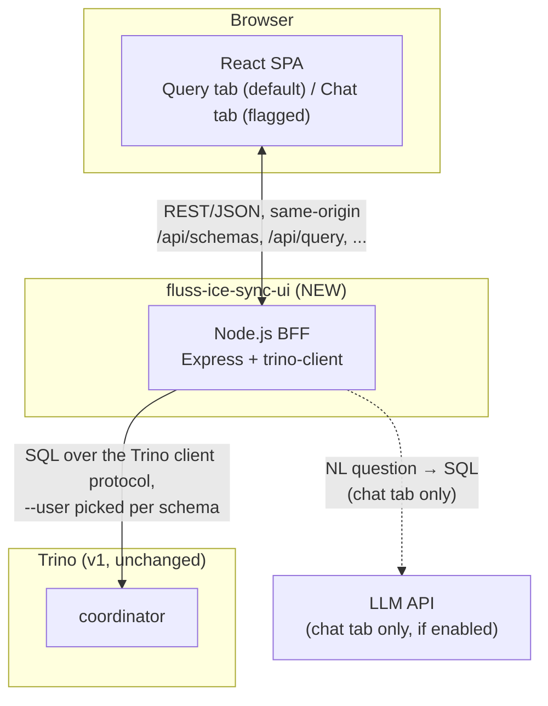
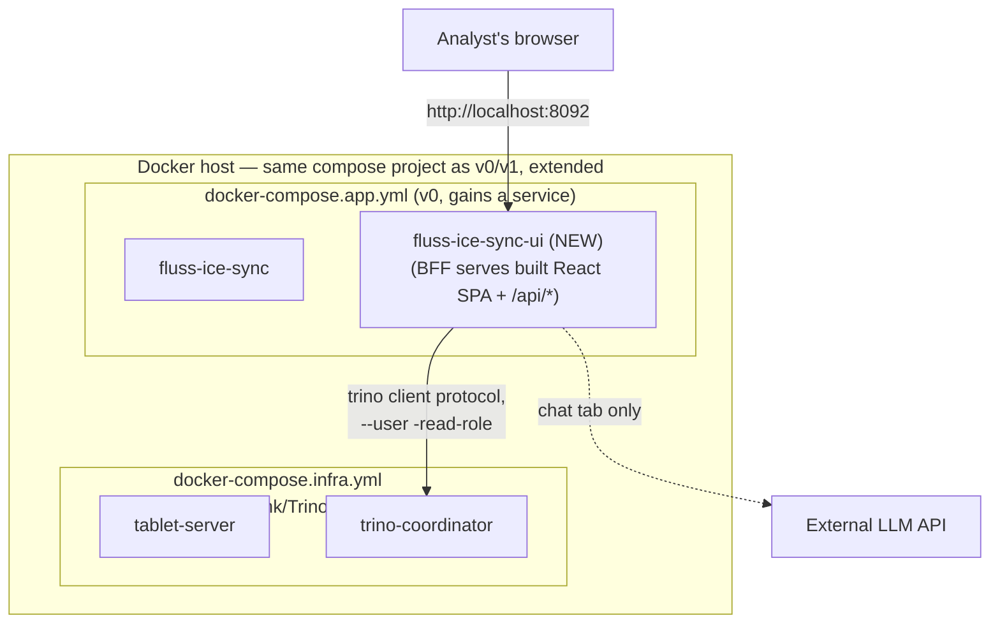

# Web UI: Design Doc

| | |
|---|---|
| **Status** | Proposed |
| **Author** | Avik Mandal |
| **Last updated** | 2026-08-27 |
| **Reviewers** | TBD |
| **Depends on** | [Trino Integration: Design Doc (v1)](./v1-trino-integration-design.md) |

## Objective

Give analysts a browser UI to explore and query the Iceberg tables Trino
already exposes (see v1), without needing a SQL client, a Trino username to
remember, or a terminal — pick a schema, pick (or browse) a table, run a
query, see the result, and get back to a recent query without re-typing it.

## Background

v1 makes every tiered `SyncSource` table queryable through Trino, but the
only documented access paths are `make trino-shell`, a raw `docker exec ...
trino --execute`, or a third-party SQL client configured with the right JDBC
URL and `--user`. That's fine for the person who wrote this repo; it's a
real barrier for anyone else who just wants to look at
`iceberg.sales.partner_orders_raw`. This design adds a small web app — a
React frontend and a Node.js backend-for-frontend (BFF) that holds the Trino
connection details — so querying is "open a URL, pick a schema, run a
query."

## Goals

* A React single-page app with two tabs: **Query** (default tab) and
  **Chat** (present only when explicitly enabled by configuration).
* **Query tab:**
  * A schema selector populated from the `iceberg` catalog (`SHOW SCHEMAS
    FROM iceberg`) — i.e. the Fluss databases that have at least one tiered
    table, per v1.
  * A table list/browser scoped to the selected schema, with column names
    and types available (`DESCRIBE`), to help write a query without
    switching to another tool.
  * A SQL editor to write and run a `SELECT` query against the selected
    schema, and a results grid (columns + rows) for the response.
  * Up to the **last 10 executed queries, each with its result**, kept as
    browsable history — re-running or re-viewing a prior query doesn't
    require retyping it.
* **Chat tab** (feature-flagged, off by default): a natural-language box
  that turns a question about the selected schema into a `SELECT` query,
  runs it the same way the Query tab does, and shows the same kind of
  result. Hidden entirely from the UI when the feature flag is off.
* A Node.js BFF that is the *only* thing holding Trino connection details
  and the per-schema read role (see [Security](#security--privacy)) — the
  browser never talks to Trino directly and never sees a Trino username.
* Read-only, `SELECT`-only access — this UI adds no write/DDL capability
  Trino's existing access control doesn't already block (see v1's
  `rules.json`).
* Deploy the UI alongside the existing stack via `config/docker/*.yml` +
  `Makefile`, following v0/v1's convention.

## Non-Goals

* Authentication/authorization of *end users* of this UI (login, SSO,
  per-person roles). v1's schema-level access control is enforced against
  the BFF's own Trino identity, not per-browser-user identity — see
  [Security & Privacy](#security--privacy) and
  [Deferred to v3](#deferred-to-v3).
* A general-purpose SQL IDE (query formatting, autocomplete beyond basic
  table/column hints, multi-statement scripts, saved/named queries beyond
  the 10-item history).
* Writing data back into Fluss or Iceberg from the UI.
* Persisting query history server-side or across devices/browsers — v1 of
  this design keeps history client-side (see
  [Query history](#query-history)).
* A production-grade chat/LLM integration (prompt tuning, multi-turn
  memory, cost controls beyond a basic rate limit). The Chat tab here is
  intentionally the minimal version: NL question in, one `SELECT` out.
* Building a BI/dashboarding layer (charts, saved dashboards) — that's a
  different tool; this is a query console.

## Overview



At a high level:

1. The browser loads a single React app served by the BFF itself (see
   [Repository Layout](#repository-layout) for why it's one service, not
   two).
2. The Query tab asks the BFF for schemas/tables/columns, which the BFF
   fetches from Trino's `information_schema`/`SHOW` commands and caches
   briefly (metadata changes only when a `SyncSource` is added or tiering
   status changes — see v1).
3. Running a query posts the SQL text to the BFF, which executes it against
   Trino using the read role that matches the selected schema
   (`<schema>-read-role`, the same naming convention v1's
   `rules.json` already uses) and returns columns + rows (capped, see
   [Query execution](#query-execution)).
4. The React app keeps the last 10 (query, result) pairs in the browser's
   own storage, not on the BFF, and renders them as history entries.
5. If the Chat tab is enabled, a question typed there is sent to the BFF,
   which asks a configured LLM to produce a `SELECT` against the selected
   schema's known tables/columns, then executes it through the same path as
   the Query tab.

## Repository Layout

```
fluss-ice-sync/
├── app/
│   ├── sync/                    # unchanged from v0/v1
│   └── ui/                      # NEW
│       ├── Dockerfile           # multi-stage — build web/, then run bff/ serving it;
│       │                        # build context is app/ui/ itself, so this lives
│       │                        # next to what it builds rather than under config/docker/
│       ├── web/                 # React + TypeScript (Vite)
│       │   ├── src/
│       │   │   ├── tabs/
│       │   │   │   ├── QueryTab/          # schema/table picker, SQL editor, results grid, history panel
│       │   │   │   └── ChatTab/           # NL input, transcript, reuses results grid
│       │   │   ├── api/                   # typed fetch wrappers for the BFF's REST endpoints
│       │   │   └── history/               # localStorage-backed ring buffer (see Query history)
│       │   └── package.json
│       └── bff/                 # Node.js + TypeScript (Express)
│           ├── src/
│           │   ├── routes/
│           │   │   ├── schemas.ts         # GET /api/schemas, /api/schemas/:schema/tables[/:table/columns]
│           │   │   ├── query.ts           # POST /api/query
│           │   │   ├── chat.ts            # POST /api/chat (only mounted when CHAT_ENABLED=true)
│           │   │   └── config.ts          # GET /api/config (feature flags for the SPA)
│           │   ├── trino.ts               # trino-client wrapper; --user selection by schema
│           │   └── server.ts              # serves web/dist as the SPA + mounts the /api routes
│           └── package.json
├── config/
│   ├── docker/
│   │   ├── docker-compose.infra.yml       # ZooKeeper, Fluss, the Iceberg catalog DB, the Flink
│   │   │                                  # tiering job, and Trino -- lakehouse.yml/trino.yml
│   │   │                                  # (v1) were later folded in here, and trino/Dockerfile
│   │   │                                  # dropped (trino-coordinator now uses `image:` directly)
│   │   └── docker-compose.app.yml         # gains fluss-ice-sync-ui service (NEW)
│   ├── resources/
│   │   ├── spec/                # SyncSource *.yaml (config/resources/*.yaml directly, in v1)
│   │   └── branding/             # NEW: UI logo asset(s), bind-mounted at /branding
│   └── apps/
│       └── ui/
│           └── application.yaml           # NEW: BFF config (Trino coordinator URL, chat flag, LLM settings)
├── doc/
│   └── design/
│       └── v2-web-ui-design.md            # this file
└── Makefile                     # ui service picked up by existing `make up`/`make down`
```

* `app/ui/web` and `app/ui/bff` are two packages under one `app/ui/`
  service, not two separately deployed containers — see
  [Alternatives Considered](#alternatives-considered) for why a single
  container serving both the static SPA and the API is preferred over a
  separate nginx/static host plus a separate API container: it avoids a
  second reverse-proxy hop, and (more importantly) keeps the browser
  same-origin with the BFF so there's no CORS configuration surface and no
  risk of the SPA being served from somewhere that bypasses the BFF's
  Trino-credential boundary.
* `app/ui/Dockerfile` lives inside `app/ui/` itself (not
  `config/docker/ui/Dockerfile`, its original location), with the build
  context set to `app/ui/` rather than the repo root — it's a
  self-contained Node/TypeScript build with no dependency on anything else
  in the repo, unlike `app/sync/Dockerfile`, which needs a repo-root
  context for the Gradle multi-module build.
* `config/resources/spec/` holds the SyncSource YAML files v0/v1 had
  directly under `config/resources/*.yaml` — moved once `config/resources/`
  also started holding `branding/` (this doc's logo asset), so the
  SyncSource specs needed their own subdirectory rather than being mixed in
  at the same level as unrelated UI assets. `FlussSyncConfigLoader` scans
  its target directory non-recursively, so `docker-compose.app.yml`'s mount
  points `fluss-ice-sync`'s `/config/resources` at `config/resources/spec/`
  specifically, not the `config/resources/` parent.
* `config/apps/ui/application.yaml` mirrors v0/v1's existing
  `config/apps/sync/application.yaml` pattern: one YAML file per app under
  `config/apps/<name>/`, mounted read-only into the container, rather than
  baking config into the image.
* **The UI is a new service inside `docker-compose.app.yml`, not a new
  compose file.** v1 originally gave Trino and the tiering job their own
  files because each was, at the time, a genuinely separate concern
  someone might want running (or not) independently of a plain
  fluss-ice-sync dev loop — though those files were later folded into
  `docker-compose.infra.yml` anyway (see above), since in practice that
  independence was never exercised and one file per Docker-Compose-only
  concern didn't earn its keep. The UI never had that property to begin
  with — it's an application-layer consumer of the same `fluss-ice-sync`
  "app" concern `docker-compose.app.yml` already groups, and it has a hard
  runtime dependency on Trino regardless, so there's no meaningful "bring
  up the app without the UI" scenario worth a separate file.
  `docker-compose.app.yml` already isn't included in `make infra-up`, so
  the plain-ingestion dev loop stays Node-build-free either way. `make
  up`'s existing `-f` list needs no change for the UI specifically —
  `docker-compose.app.yml` is already in it (though note `infra-up` itself
  now also brings up Flink/Trino, per the `docker-compose.infra.yml` merge
  above).

## Detailed Design

### Query tab

* **Schema selector** — a dropdown populated by `GET /api/schemas`, which
  runs `SHOW SCHEMAS FROM iceberg` against Trino and filters out Trino's own
  housekeeping schemas (`information_schema`). Selecting a schema is a
  client-side-only state change until a table is picked or a query is run.
* **Table browser** — once a schema is selected, `GET
  /api/schemas/:schema/tables` (`SHOW TABLES FROM iceberg.<schema>`) lists
  tables; clicking one calls `GET
  /api/schemas/:schema/tables/:table/columns` (`DESCRIBE
  iceberg.<schema>.<table>`) and inserts a starter `SELECT * FROM
  iceberg.<schema>.<table> LIMIT 100` into the editor rather than requiring
  the user to type the fully-qualified name from scratch.
* **SQL editor** — a plain textarea-class editor (e.g. CodeMirror) with SQL
  syntax highlighting; no bespoke query builder UI for v2 — see
  [Non-Goals](#non-goals).
* **Run** — posts `{ schema, sql }` to `POST /api/query`; the BFF rejects
  anything that isn't parseable as a single read-only statement (see
  [Query execution](#query-execution)) before sending it to Trino, executes
  it, and returns `{ columns: [{name, type}], rows: [...], rowCount,
  truncated, durationMs }`.
* **Results grid** — a simple sortable/scrollable table of the returned
  columns and rows; `truncated: true` (see below) surfaces a visible "showing
  first N rows" notice rather than silently dropping rows.

### Query execution

* The BFF caps every query at a configurable row limit (default 1,000) and
  a query timeout (default 30s), both enforced Trino-side via `SET SESSION`
  / Trino client options, not by discarding rows after a full unbounded
  fetch — protects both the browser (no giant payload) and Trino (no
  runaway scan from an accidental unbounded query against a large table).
* The BFF performs a light statement check (single statement, first
  non-whitespace keyword is `SELECT`, `SHOW`, `DESCRIBE`, or `EXPLAIN`)
  before submitting to Trino — this is a defense-in-depth UX guard (a clear
  "only SELECT-style queries are supported" error instead of an opaque
  Trino access-control rejection), **not** the actual security boundary;
  the real boundary is that every Trino role this BFF authenticates as
  holds only `SELECT` per v1's `rules.json`, so a write statement fails at
  Trino regardless of what the BFF's own check catches.
* **Which Trino user the BFF connects as is derived from the selected
  schema**: `<schema>-read-role`, matching the naming convention v1's
  `rules.json` already establishes (`sales-read-role`, `crm-read-role`,
  ...). This needs no new Trino configuration — v1's existing per-database
  read roles are reused as-is — and means a schema the UI's caller isn't
  entitled to still gets Trino's existing `Access Denied`, surfaced as an
  error in the UI rather than silently working around it.

### Query history

* Kept **client-side**, in the browser's `localStorage`, as a ring buffer
  capped at 10 entries — each entry is `{ schema, sql, columns, rows
  (capped further, e.g. 50 rows, to keep storage bounded), timestamp,
  durationMs }`. Running an 11th query evicts the oldest entry.
* No server-side history store for v2: the BFF is stateless across
  requests (see [Alternatives Considered](#alternatives-considered) for why
  this was chosen over a small server-side store), which means history is
  per-browser, not shared across devices or wiped if the BFF restarts —
  an explicit trade-off given there's no per-user identity system yet (see
  [Non-Goals](#non-goals)).
* The history panel lets a user click a past entry to reload its query text
  and previously-fetched result instantly (no re-query), or hit "Re-run" to
  execute it fresh.

### Chat tab

* Only rendered in the SPA when `GET /api/config` reports
  `chatEnabled: true`, which the BFF derives from `CHAT_ENABLED` (env var,
  surfaced via `config/apps/ui/application.yaml`) — off by default, mirroring
  v1's `lakehouse.enabledByDefault: false` precedent of shipping a capability
  dark until explicitly turned on.
* Flow: user types a question about the currently selected schema → `POST
  /api/chat { schema, question }` → the BFF fetches that schema's table/column
  metadata (same `DESCRIBE` calls the Query tab uses, cached) → sends the
  question plus that schema description to a configured LLM API, asking for
  a single `SELECT` statement → runs the returned SQL through the exact same
  `/api/query` path (including the row cap, timeout, and read-only check)
  → returns both the generated SQL and its result, so the user can see (and
  copy into the Query tab) what actually ran rather than trusting an opaque
  answer.
* The LLM provider/model/API key are BFF-side configuration
  (`config/apps/ui/application.yaml`), never exposed to the browser — the
  chat tab never calls an LLM API directly.
* If the LLM returns something that isn't a single read-only statement, or
  the generated query fails, the chat tab surfaces that failure plainly
  (mirroring the Query tab's error display) rather than silently retrying
  or hiding it.
* Chat transcripts are **not** subject to the same "10 history" cap as the
  Query tab — that limit is specific to query/result pairs per
  [Goals](#goals); chat transcript retention (if any beyond the current
  page session) is left to [Open Questions](#open-questions).

## Security & Privacy

* **The BFF is a privileged credential holder, not a pass-through** — it
  authenticates to Trino using the `<schema>-read-role` convention, and the
  browser never sees a Trino username, password, or JDBC URL. This means
  *any* user of this UI who can reach a given schema in the dropdown can
  read that schema's data — the UI currently has no per-person
  authorization layer narrower than "can reach the BFF at all," which is a
  real gap relative to v1's Trino-level per-role model. See
  [Non-Goals](#non-goals) and [Deferred to v3](#deferred-to-v3); this UI
  should not be deployed on a network segment reachable by anyone who
  shouldn't have `<schema>-read-role`-equivalent access to every tiered
  schema.
* **Chat tab sends schema/table/column names (not row data) to the
  configured LLM API** as part of building the prompt — this is metadata
  leaving the deployment boundary to a third-party API, which is a
  materially different trust boundary than the Query tab (which sends
  nothing outside this stack). This should be called out explicitly to
  whoever enables `CHAT_ENABLED`, the same way v1 calls out
  `lakehouse.enabled` as a data-classification decision, not just a config
  flip.
* **SQL injection is not applicable in the traditional sense** — the "query"
  *is* user-supplied SQL by design (that's the product), so the relevant
  boundary is Trino's own `SELECT`-only role grants (v1), not input
  sanitization. The BFF's statement-shape check (see
  [Query execution](#query-execution)) is a UX nicety on top of that, not
  the security control.
* No secrets (Trino credentials, LLM API key) are ever sent to the browser;
  `config/apps/ui/application.yaml` and any `.env`-sourced key are BFF-only,
  following v0/v1's existing pattern of config mounted read-only into the
  container rather than baked into an image or exposed client-side.

## Testing Strategy

* **BFF unit tests** — route handlers tested against a mocked Trino client:
  schema/table/column listing shapes, the row-cap/timeout options are
  actually passed through, and the statement-shape check accepts
  `SELECT`/`SHOW`/`DESCRIBE`/`EXPLAIN` and rejects everything else
  (`INSERT`, `DELETE`, multi-statement input, etc.).
* **Chat route tests** — with the LLM client mocked, confirm the BFF (a)
  builds a prompt containing the selected schema's actual table/column
  metadata, not a stale cache, and (b) routes the LLM's returned SQL through
  the same execution path — and its same checks — as `/api/query`, rather
  than a separate, unchecked execution path.
* **React component tests** — schema/table selection updates the editor's
  starter query correctly; the history ring buffer caps at 10 and evicts
  oldest-first; the Chat tab is absent from the DOM when `/api/config`
  reports `chatEnabled: false`.
* **End-to-end smoke test** — against the full Compose stack (v0 + v1 +
  this design): bring the stack up, tier a source per v1's existing
  smoke test, open the UI, select that schema, run a query against the
  tiered table, and confirm the result matches `make trino-shell`'s
  output for the same query.

## Deployment



* No change to `make up`'s `-f` list — `docker-compose.app.yml` is already
  in it, and `fluss-ice-sync-ui` is just a second service defined there
  alongside the existing `fluss-ice-sync` service. `make down`/`make logs`
  need no changes either, though `logs` still targets `fluss-ice-sync` by
  name — a `make ui-logs` (`docker compose logs -f fluss-ice-sync-ui`)
  target is a small addition alongside it.
* `fluss-ice-sync-ui` is published on the host at a new port (e.g.
  `8092`, following v1's `8090` for Trino), depends on
  `trino-coordinator` being healthy (which lives in
  `docker-compose.infra.yml` — a cross-compose-file `depends_on` works the
  same way v0/v1 already rely on across `infra`/`app`, since `make up`
  merges both into one Compose project), and reads
  `config/apps/ui/application.yaml` plus environment
  (`TRINO_COORDINATOR_URL`, `CHAT_ENABLED`, LLM API key) the same way
  `fluss-ice-sync` reads `application.yaml` in v0.

## Rollout Plan

1. Ship the BFF and Query tab first, `CHAT_ENABLED=false`, against the
   already-tiered `sales.partner_orders_raw` schema from v1's rollout —
   validate the end-to-end smoke test before wider use.
2. Once the per-schema role convention and query cap/timeout behavior are
   validated in practice, evaluate enabling `crm` once that schema is
   itself tiered (per v1's own rollout gating on source-owner sign-off —
   unrelated to this design, just inherited).
3. Enable `CHAT_ENABLED=true` only after the metadata-to-LLM data flow
   (see [Security & Privacy](#security--privacy)) has been reviewed and
   accepted for whichever LLM provider is configured.

**Rollback:** `docker compose stop fluss-ice-sync-ui` (or removing the
service from `docker-compose.app.yml`) removes the UI entirely; it holds no
state Trino/Fluss depend on and performs no writes, so rollback is
non-destructive to the rest of the stack.

## Alternatives Considered

**Two separately deployed containers (a static file host for the React
build, a separate API container for the BFF) instead of one.** More
conventional for larger deployments, but adds a second network hop and a
CORS surface for no benefit at this scale, and — more importantly — makes
it easier to accidentally serve the SPA from a path that doesn't enforce
the BFF's Trino-credential boundary (e.g. a CDN in front of the static
files with the API elsewhere). One container serving both, same-origin, is
simpler and safer for v2. Revisit if the SPA needs independent CDN-scale
caching that the BFF container can't provide.

**Browser talks to Trino directly (via `trino-client`'s browser build or a
REST proxy Trino itself exposes) instead of through a BFF.** Would remove a
hop, but requires the browser to hold (or the user to type) a Trino
username per schema, defeating the "no SQL client, no username to
remember" goal, and removes the one place (the BFF) where the row
cap/timeout/statement-shape checks and the chat-tab LLM key can live
server-side. Rejected.

**Server-side (BFF-held) query history instead of client-side
`localStorage`.** Would survive a browser storage clear and work across
devices, but requires either a database (new stateful service, the kind
v1's Alternatives Considered section repeatedly avoided adding for
lightweight metadata) or an in-memory store tied to a specific BFF
replica/session with no real user-identity system to key it on yet (see
[Non-Goals](#non-goals)). Client-side is sufficient for the stated
"up to 10, with result" requirement and adds no new stateful
infrastructure. Revisit once/if a real login system exists (see
[Deferred to v3](#deferred-to-v3)).

## Open Questions

* Should the Chat tab's transcript persist across page reloads (and if so,
  client-side like query history, or is that out of scope until there's a
  real per-user identity system)?
* Which LLM provider/model is actually approved for the metadata-to-LLM
  data flow the Chat tab introduces — this design assumes "configurable,"
  not a specific provider.
* Does `<schema>-read-role` remain the right granularity once this UI is
  the primary access path for non-technical users, or does it need its own
  per-person authorization layer sooner than v1's Trino-level model implied
  (see [Deferred to v3](#deferred-to-v3))?
* What's the actual row cap / timeout analysts need in practice, versus the
  1,000-row / 30s defaults assumed here?

## Deferred to v3

* **Per-user authentication and authorization** for the UI itself (login,
  SSO, mapping an authenticated person to the specific `<schema>-read-role`
  set they're entitled to) — v2 has no notion of a UI-level user distinct
  from "anyone who can reach the BFF."
* **Server-side, cross-device query/chat history**, once a real user
  identity system exists to key it on.
* **A richer SQL editing experience** — autocomplete against live schema
  metadata, query formatting, saved/named queries beyond the 10-item
  rolling history.
* **Result export** (CSV/download) from the results grid.
